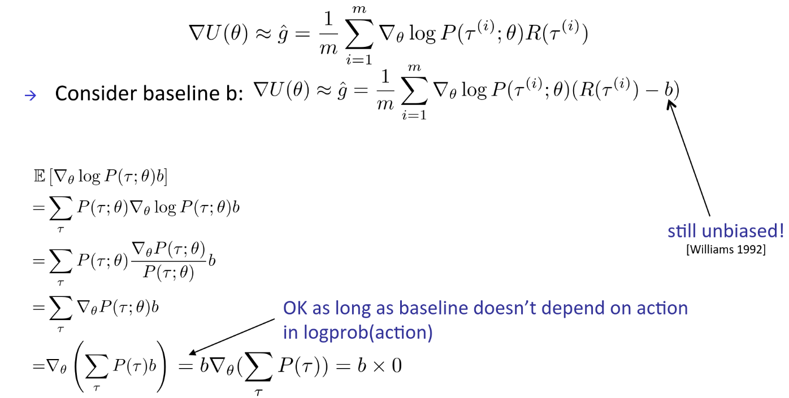
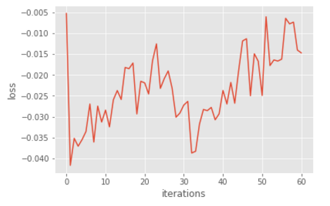
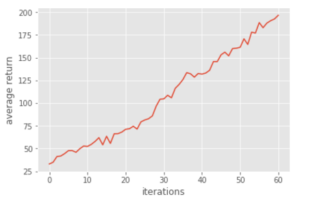
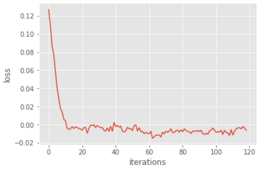
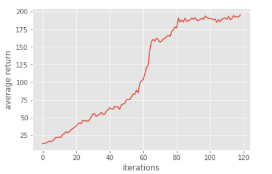
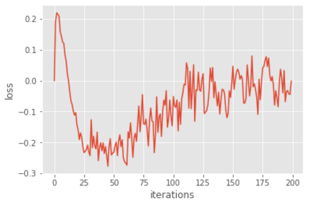
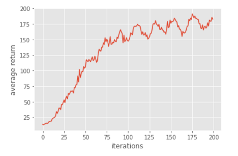
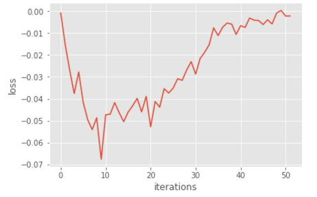
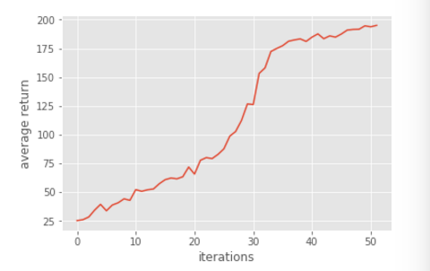

# Homework3-Policy-Gradient report
## Problem 1 : Construct a neural network to represent policy


```
  fc1 = tf.contrib.layers.fully_connected(self._observations, hidden_dim, activation_fn=tf.nn.tanh)
  fc2 = tf.contrib.layers.fully_connected(fc1, out_dim, activation_fn=None)
  probs = tf.contrib.layers.softmax(fc2)
```
用兩層 fully-connected 建立 policy network。定義fully-connected layer 需要給定input和 output neuron number, 使用tanh當作 activation function。

## Problem 2 : Compute the Surrogate Loss
```
surr_loss = -tf.reduce_mean(self._advantages * log_prob)
```
根據公式，surrogate loss是對應的advantage乘上機率，取平均。因為tensorflow只能做minimize的optimization，所以要把reward取負號得到surrogate loss。

## Problem 3 : Reduce Variance Using a Baseline

```
 # YOUR CODE HERE >>>>>>
 a = r - b
 # <<<<<<<<

p["returns"] = r
p["baselines"] = b
p["advantages"] = (a - a.mean()) / (a.std() + 1e-8) # normalize
```
將 reward 減掉baseline。Baseline是estimate的value function，減掉baseline讓reward必須大於目前的value，才鼓勵 model 做這樣的動作。再數學上來看是減少了variance可以讓training更穩定。

## Problem 4 : Compare the Results Before and After Adding Baseline

### 1. Why the baseline won't introduce bias

</td>

reward 減去 baseline 只會多一項，expectation of prob * b
baseline只要跟action無關，微分後都是0，完全不影響結果。所以baseline並不會造成bias。

### 2. Compare with no baseline

With baseline
reward上升的比較快，大約60 iteration就解決。

</td>
</td>

Without baseline
reward 上升比較慢，120 iteration才解決。

</td>
</td>

## Problem 5 : Actor-Critic Algorithm (With Bootstrapping)

```
b_sift = np.roll(b, -1)
b_sift[-1] = 0.0
return x + discount_rate * b_sift
```
這邊的方法進一部減少variance。本來的方法是將本次time_step到未來的immediate reward全部加總，但是全部都用sample的結果會有很高的variance。為了解決，這裡只有本次time_step用immediate reward，後面的部份則用，下一個time_step estimate的value function，來代替。因為value function是多次sample學習的結果，不會變動太大，variance可以下降，但是也造成一些bias。

result:
到200 iteration都還無法解決，可能是bias緣故造成train無法收斂。

</td>
</td>

## Problem 6 : Generalized Advantage Estimation

```
a = util.discount(a, self.discount_rate * LAMBDA)
```
這個方法是將problem3和problem5的方法結合在一起，用一個Lambda做權重。

result : 
搭配兩個方法的長處，model很快就收斂了

</td>
</td>

