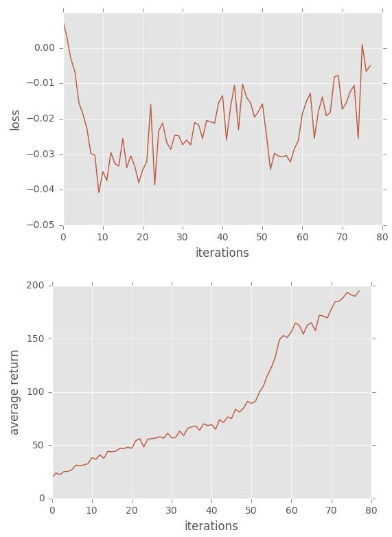
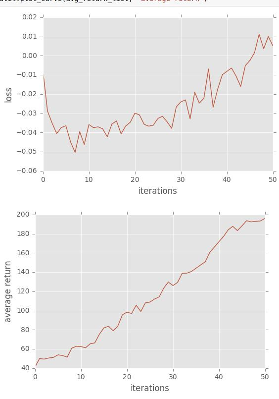
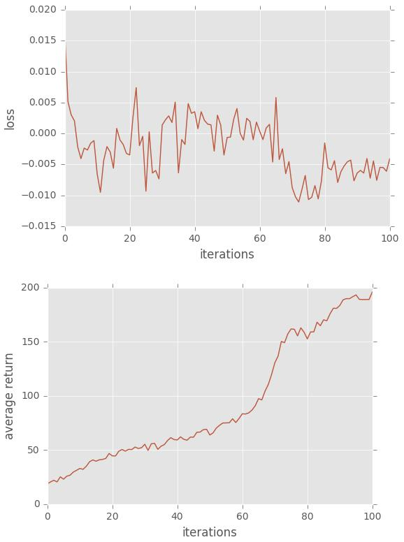
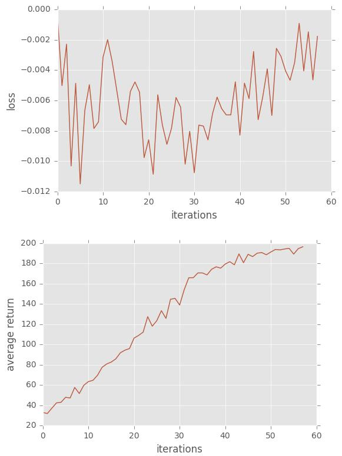
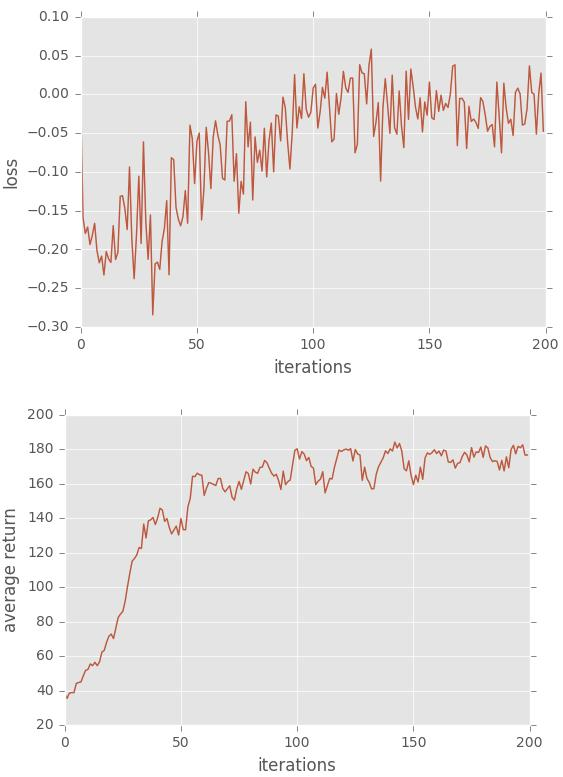
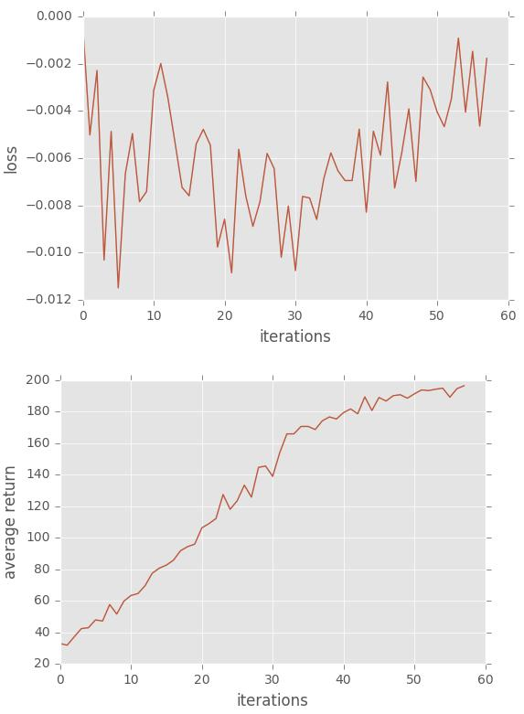

# Homework3-Policy-Gradient report

# 105061607 邱浩翰

# Problem 1: construct a neural network to represent policy
Construct a 2-layer neural network with Tensorflow api.

```
        hl = tf.contrib.layers.fully_connected(self._observations, hidden_dim, activation_fn = tf.tanh)
        probs = tf.contrib.layers.fully_connected(hl, out_dim, activation_fn = tf.nn.softmax)
```

# Problem 2: compute the surrogate loss
Use 'tf.reduce_mean' to calculate surrogate loss, btw forget adding '-' bother me a while...

```
        surr_loss = -tf.reduce_mean(log_prob * self._advantages, name="loss_op")
```

# Problem 3: Compare with baseline
This just compare the reward I get with baseline.I'd test two times,and found that the second test converge faster.

```
            a = r-b
```
1st Result :

<p align="center"></p>

2nd Result :

<p align="center"></p>


# Problem 4: No baseline version
Compare with/without baseline.<br>
It will took more (1st:78->100,2nd:50 -> 58)iteration to converge,and much more variance.<br>

I test two times as problem 3.

```
            a = r-b
```
1st Result :

<p align="center"></p>

2nd Result :

<p align="center"></p>

# Problem 5: Actor-Critic algorithm (with bootstrapping)
One-step bootstrap for the advantage function.<br>
It took really long time (200iteration),but the variance very low.<br>
```
	b_next = np.append(b[1:], 0) 
	y = x + discount_rate * b_next 
	return y
```
Result :

<p align="center"></p>

# Problem 6: Generalized Advantage Estimation
This method which 'performance of average return' quickly increase and converge fast (60 iteration)<br>
```
a = util.discount(a, LAMBDA* self.discount_rate)
```
Result :

<p align="center"></p>
