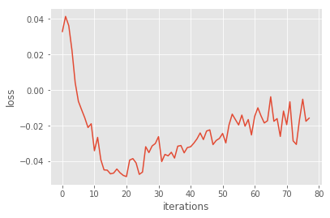
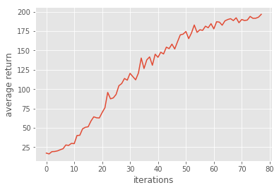
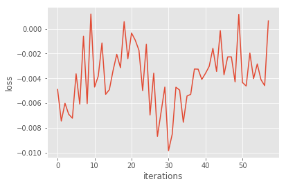
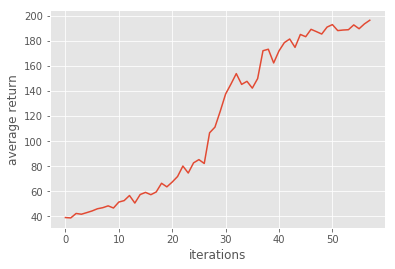
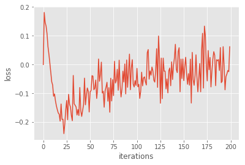
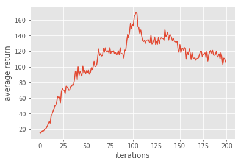
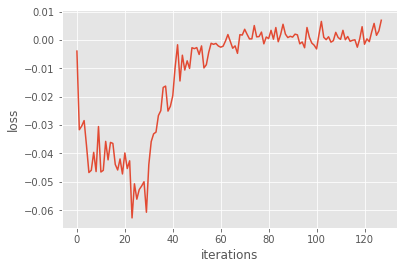
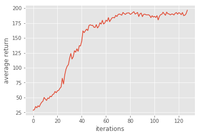

# Homework3 Report: Policy Gradient

### 10606 楊朝勛
## Introduction

We will use ```CartPole-v0``` as environment in this homework. The following gif is the visualization of the CartPole: 

## Setup
- Python 3.5.3
- OpenAI gym
- tensorflow
- numpy
- matplotlib
- ipython

## Implementation
Policy gradient depends on optimizing parametrized policies with the long-term cumulative reward by gradient descent. High rewards from good actions and negative rewards from bad actions, so it will increase the probability of the good actions.

### Problem 1: construct a neural network to represent policy
We can use a neural network to output prediction of action. 
```python
h1 = tf.contrib.layers.fully_connected(self._observations, num_outputs=hidden_dim, activation_fn=tf.tanh)   
h2 = tf.contrib.layers.fully_connected(h1, num_outputs=out_dim, activation_fn=None)
probs = tf.nn.softmax(h2)
```
### Problem 2: compute the surrogate loss
Tensorflow can only doing minimize loss
To getting maximum the policy,we add minus before the policy.
```python
surr_loss = -tf.reduce_mean(log_prob*self._advantages)
```
### Problem 3: Sampling-based Tabular Q-Learning
Using baseline to reduce the variance of our gradient estimate.
In order to reduce the variance of the gradient estimator, a constant baseline can be subtracted from the gradient.
```python
a = r -b
```


Results:
  <div align="center">
	
	
  </div>

### Problem 4: Compare baseline with non-baseline


Non-baseline:
<div align="center">
	
	
</div>

Without baseline, the varience becomes to be very large ,making policy gradient more unstable.

<b>Why the baseline won't introduce bias?</b>


### Problem 5: Actor-Critic algorithm (with bootstrapping)
Actor is based on policy-iteration methods such as Policy Gradient, and  Critic is based on value-iteration methods such as Q-learning. Actor-Critic combines the benefits of both approaches that actor improves the current policy, and critic evaluates the current policy.


```python
def discount_bootstrap(x, discount_rate, b):
	b_ = np.append(b[1:], 0)
    return x + discount_rate * b_

r = util.discount_bootstrap(p["rewards"], self.discount_rate, b)
a = r - b
```

Result:
<div align="center">
	
	
</div>

The oringinal method of actor critic is very unstable.
It is because every time when we update the policy,also making impact to others,and making it difficult to converge.

### Problem 6: Generalized Advantage Estimation

```python
a = util.discount(a,self.discount_rate*LAMBDA)
```
result:


<div align="center">
	LAMBDA = 0.98
	
	  
</div>

When Lamda is nearby 1,every states in the future participate the decision of policy.
When Lamda is nearby 0,only the state right now  participate the decision of policy.

