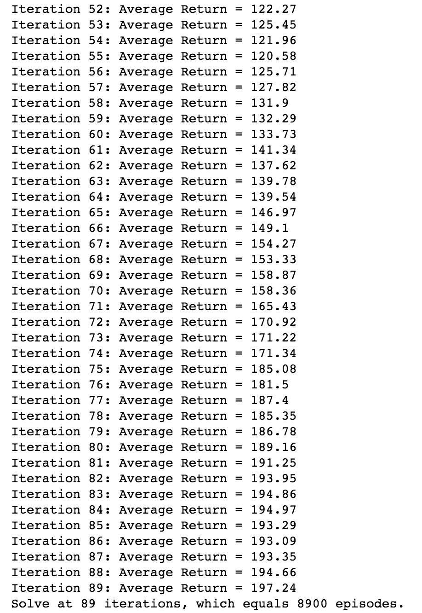
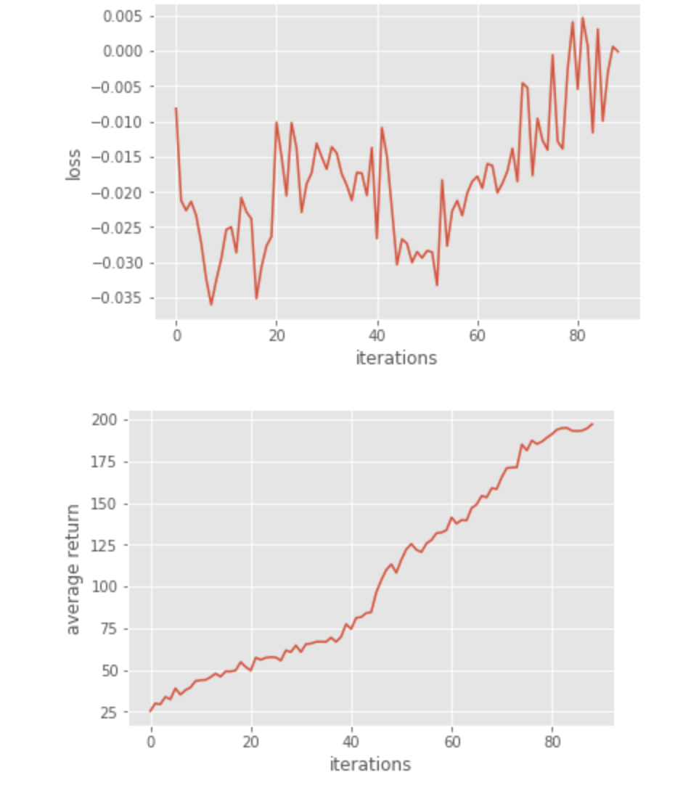
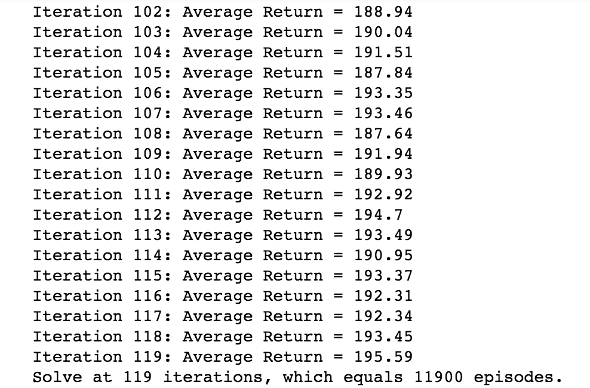
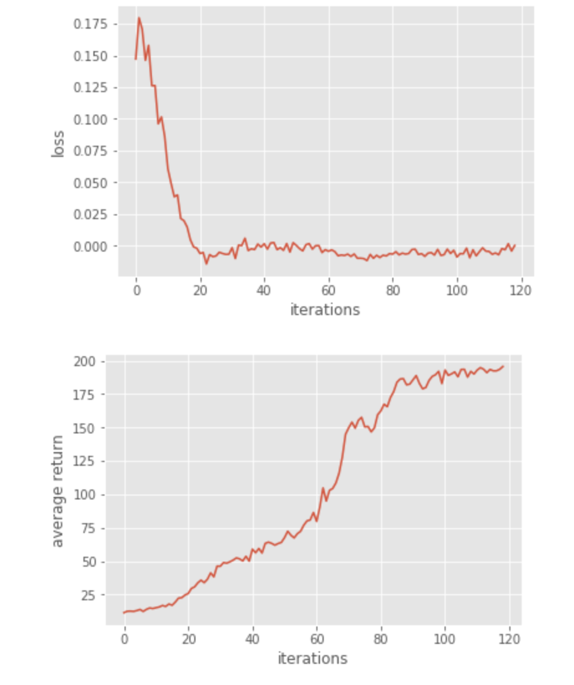
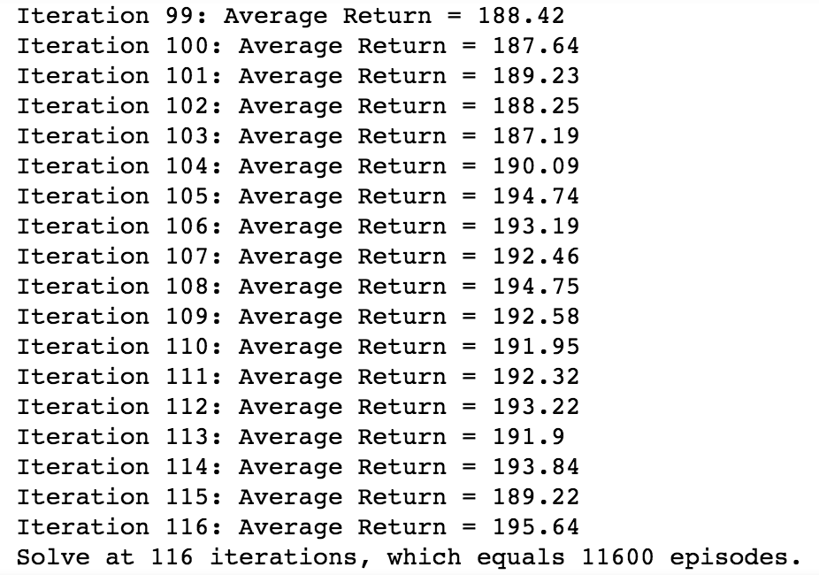
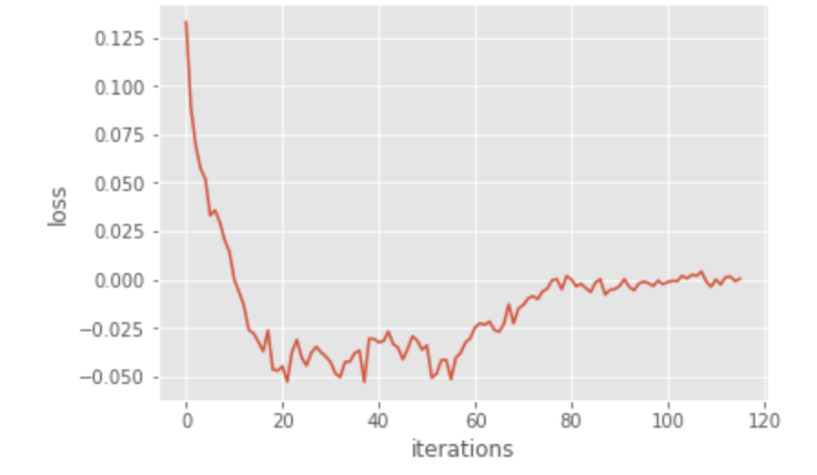
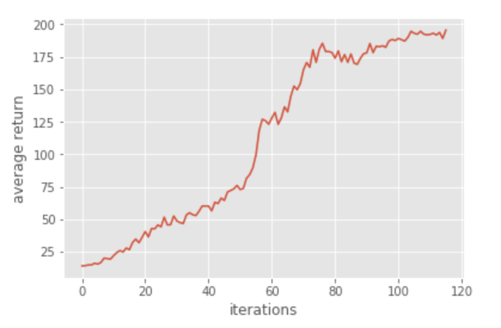

# Homework3-Policy-Gradient report

## (105061583 賴承薰)

### Envs
* python 3.5
* tensorflow
* Jupyter Notebook
* Numpy
* Gym
* math
* scipy
* matplotlib

### Implemantation

#### Problem 1: construct a neural network to represent policy

According to the instruction, there should be two hidden layer in the NN.
The first layer is activated by tanh, the second layer outputs the sofmaxed result which is named 'probs'

```
h1 = tf.contrib.layers.fully_connected(inputs = self._observations, num_outputs = hidden_dim, activation_fn = tf.nn.tanh)
probs = tf.contrib.layers.fully_connected(inputs = h2, num_outputs = out_dim, activation_fn = tf.nn.softmax)
```

#### Problem 2: compute the surrogate loss

By the REINFORCE algorithm, we can obtain the empirical policy gradient and update the gradient step by step.
We can first construct the computation graph for  L(θ) , and then take its gradient as the empirical policy gradient.

```
surr_loss = -tf.reduce_mean(tf.mul(log_prob, self._advantages), name = "loss_op")
```

#### Problem 3: Use baseline to reduce the variance of our gradient estimate

1. Variable `b` is the values predicted by our baseline
2. Use it to reduce variance and then assign the result to the variable `a` (baseline reduction)

```
a = r - b

p["returns"] = r
p["baselines"] = b
p["advantages"] = (a - a.mean()) / (a.std() + 1e-8) # normalize
```



-------------------------------------------------------------------------------------------------------------------

#### Problem 4: remove the baseline and compare the variance and performance before and after adding baseline




調整gradient的時候，會連帶增加具有positive reward的trajectory的機率，同時減少negative reward的trajectory的機率。
假設所有的policy都是positive reward，我們一旦調整gradient的時候就會讓所有選擇的概率都一起上升，使我們比較容易選到沒有那麼好的policy。
如果加上baseline可以視為一個分水嶺把reward沒有那麼高的選擇區別為壞的，減少選到小於b的機率。
由於gradient是target function的first deriviate，這會需要考慮step size，萬一step size過大，update出來的policy表現一下下降很多，又根據不好的policy去選擇trajectory，又根據不好的trajectory去做更新，不好的表現就會propagate，這樣一來policy的variance就會很大。

#### Problem 5: Actor-Critic algorithm (with bootstrapping)

Implement the function discount bootstrap in a simple actor-critic algorithm

```
y = np.zeros(len(x))
for i in range(len(x)-1):
    y[i] = x[i] + discount_rate * b[i+1] - b[i]
y[-1] = x[-1]
return y
```

The variable 'x' is the immediate reward for each timestep.
And thw variable 'b' is the prediction of the baseline

#### Problem 6: Generalized Advantage Estimation

We use a novel advantage function called "Generalized Advantage Estimation", which introduces one hyperparameter λ to compromise the above two estimation methods.

```
r = util.discount_bootstrap(p["rewards"], self.discount_rate, b)
target_v = util.discount_cumsum(p["rewards"], self.discount_rate)
a = r - b

a = util.discount(r, discount_rate* LAMBDA)

p["returns"] = target_v
p["baselines"] = b
p["advantages"] = (a - a.mean()) / (a.std() + 1e-8) # normalize
```




