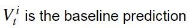
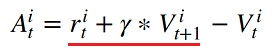
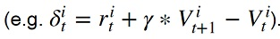

# 何品萱 (106062553)
## Homework3-Policy-Gradient report


#### Algorithms and code details


##### Problem 1: construct a neural network to represent policy
Use TensorFlow to construct a 2-layer neural network as stochastic policy.

```
  fc1 = tf.layers.dense(inputs=self._observations , units=hidden_dim, activation=tf.nn.tanh)
  fc2 = tf.layers.dense(inputs=fc1 , units=out_dim, activation=tf.nn.softmax) 
  probs = fc2
```

##### Problem 2: compute the surrogate loss
accumulated discounted rewards
<p></p>

surrogate loss
<p></p>

```
  surr_loss = -tf.reduce_mean(log_prob * self._advantages)
```

##### Problem 3: reduce the variance of our gradient estimate
Change the loss term into:
<p></p>
<p></p>

```
  a = r - b
```

###### Results


##### Problem 4
Compare the variance and performance before and after adding baseline.

with the baseline
<p align="center"></p>
smaller variance 

be biased

without the baseline
<p align="center"></p>
larger variance

unbiased

Why the baseline won't introduce bias?


##### Problem 5: Actor-Critic algorithm (with bootstrapping)
use the one-step bootstrap for the advantage function
<p></p>

```
    b = np.roll(b, -1)    #Vt+1
    b[-1] = 0
    y = x + discount_rate *b
```

##### Problem 6: Generalized Advantage Estimation
use "Generalized Advantage Estimation" for the advantage function

compromise the above two estimation methods(REINFORCE and TD)
<p></p>
<p></p>

```
  a = util.discount(a, self.discount_rate * LAMBDA)
```

###### Results


