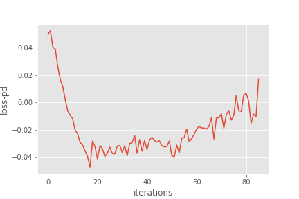
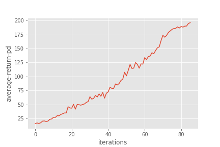
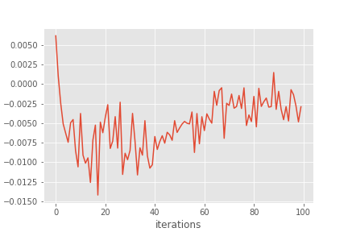
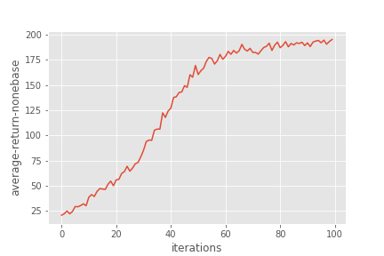
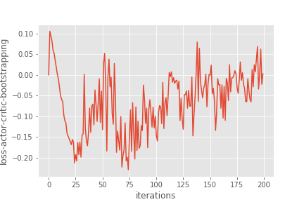
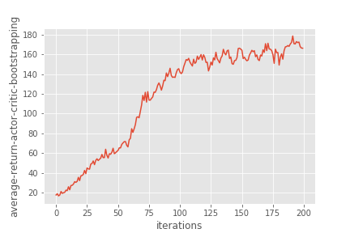
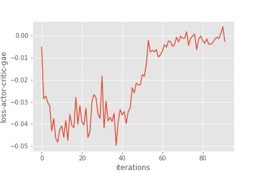
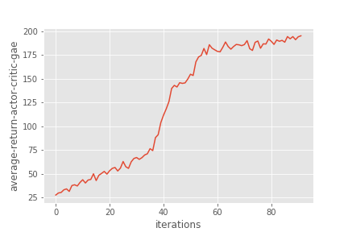

# Homework3-Policy-Gradient report (105061523)
In this assignment, we will solve a classic control problem - CartPole using policy gradient methods.
Policy gradient method is a family of RL algorithms that parameterizes the policy directly. The simplest advantage that policy parameterization may have over action-value parameterization is that the policy may be a simpler function to approximate.
<center></center>


## Problem 1: Construct a neural network to represent policy
Construct a 2-layer neural network, with tnah as activation function and softmax function as output layer.

```python
    # fc1
    layer = tf.layers.dense(
        inputs = self._observations,
        units = hidden_dim,
        activation = tf.nn.tanh,  # tanh activation
        kernel_initializer = tf.random_normal_initializer(mean=0, stddev=0.3),
        bias_initializer = tf.constant_initializer(0.1),
        name='fc1'
    )
    # fc2
    all_act = tf.layers.dense(
        inputs = layer,
        units = out_dim,
        activation = None,
        kernel_initializer = tf.random_normal_initializer(mean=0, stddev=0.3),
        bias_initializer = tf.constant_initializer(0.1),
        name='fc2'
    )

    probs = tf.nn.softmax(all_act, name='probs')  # use softmax to convert to probability

```


## Problem 2: Compute the surrogate loss
Surrogate loss:
<a href="https://www.codecogs.com/eqnedit.php?latex=L(\theta)&space;=&space;\frac{1}{(NT)}(\sum_{i=1}^N&space;\sum_{t=0}^T&space;log\pi_\theta(a_t^i&space;|&space;s_t^i)&space;*R_t^i)" target="_blank"></a>

```python
    surr_loss = tf.reduce_mean(-log_prob * self._advantages)  # reward guided loss
    grads_and_vars = self._opt.compute_gradients(surr_loss)
    train_op = self._opt.apply_gradients(grads_and_vars, name="train_op")

```


## Problem 3: Add baseline for advaantage function
To reduce the variance of our gradient estimation, we change the loss term:<br>
<center><a href="https://www.codecogs.com/eqnedit.php?latex=L(\theta)&space;=&space;\frac{1}{(NT)}(\sum_{i=1}^N&space;\sum_{t=0}^T&space;log\pi_\theta(a_t^i&space;|&space;s_t^i)&space;*R_t^i)" target="_blank"></a></center> <br>
into this one: <br>
<center><a href="https://www.codecogs.com/eqnedit.php?latex=L(\theta)&space;=&space;\frac{1}{(NT)}(\sum_{i=1}^N&space;\sum_{t=0}^T&space;log\pi_\theta(a_t^i&space;|&space;s_t^i)&space;*(R_t^i-V_t^i))" target="_blank"></a></center> <br>
where <a href="https://www.codecogs.com/eqnedit.php?latex=V_t^i" target="_blank"></a> is the baseline prediction for at the <a href="https://www.codecogs.com/eqnedit.php?latex=t" target="_blank"></a> timestep <a href="https://www.codecogs.com/eqnedit.php?latex=i^{th}" target="_blank"></a> trajectory. In this part, we use a simple linear function to parameterize value function.

```python
	r = util.discount_cumsum(p["rewards"], self.discount_rate)
    a = r-b
    p["returns"] = r
    p["baselines"] = b
    p["advantages"] = (a - a.mean()) / (a.std() + 1e-8) # normalize

```
<br>

The final result solved at 86 iterations, which equals 8600 episodes.
<tr>
	<td>
	
	
	</td>
</tr>

## Problem 4: Remove baseline to calculate advantage function 
Replacing line
```python
baseline = LinearFeatureBaseline(env.spec)
```
with
```python
baseline = None
```
<br>
The final result solved at 100 iterations, which equals 10000 episodes.
<tr>
	<td>
	
	
	</td>
</tr>


## Problem 5: Actor-Critic algorithm (with bootstrapping)
The baseline reduction lowers the variance without the cost of introducing bias. In this part, you will implement a simple actor-critic algorithm. We use the one-step bootstrap for the advantage function, which change the <a href="https://www.codecogs.com/eqnedit.php?latex=A_t^i=(R_t^i-V_t^i)" target="_blank"></a> in problem 3 into: <br>
<center><a href="https://www.codecogs.com/eqnedit.php?latex=A_t^i&space;=&space;r_t^i&space;&plus;&space;\gamma*V_{t&plus;1}^i&space;-&space;V_t^i" target="_blank"></a>
</center><br>
<br>
The final result solved doesn't reaches the game ending crteria. Still working on the reasons ...
<tr>
	<td>
	
	
	</td>
</tr>


## Problem 6: Generalized Advantage Estimation
Here, we use a novel advantage function called "Generalized Advantage Estimation", which introduces one hyperparameter <a href="https://www.codecogs.com/eqnedit.php?latex=\lambda" target="_blank"></a> to compromise the above two estimation methods.

Assume the <a href="https://www.codecogs.com/eqnedit.php?latex=\delta_t^i" target="_blank"></a> represent the i-step bootstrapping (e.g. <a href="https://www.codecogs.com/eqnedit.php?latex=\delta_t^i=r_t^i&space;&plus;&space;\gamma*V_{t&plus;1}^i&space;-&space;V_t^i" target="_blank"></a>). The generalized advantage estimation will be: <br>
<center><a href="https://www.codecogs.com/eqnedit.php?latex=A_{t}^{GAE}&space;=&space;\sum_{l=0}^{\infty}&space;(\gamma\lambda)^l&space;\delta_{t&plus;1}" target="_blank"></a> <br></center> <br>

```python
	def discount(x, discount_factor):
	    return lfilter([1.0], [1.0, -discount_factor], x[::-1])[::-1]
    r = util.discount_bootstrap(p["rewards"], self.discount_rate, b)
    target_v = util.discount_cumsum(p["rewards"], self.discount_rate)
    a = r - b
    a = util.discount(a, self.lamb*self.discount_rate)
```
<br>
The final result solved at 92 iterations, which equals 9200 episodes.
<tr>
	<td>
	
	
	</td>
</tr>
