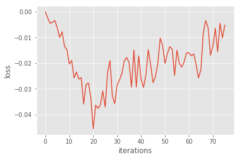
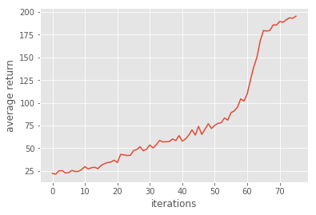
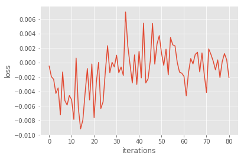
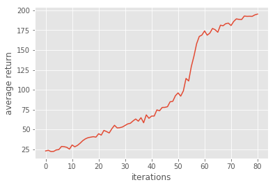
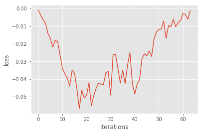
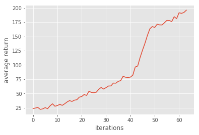

# Homework3-Policy-Gradient report

TA: try to elaborate the algorithms that you implemented and any details worth mentioned.

## Problem 1~3

<table border=1>
<td>

</td>
</table>

<table border=2>
<td>

</td>
</table>

<table border=3>
<td>

</td>
</table>
