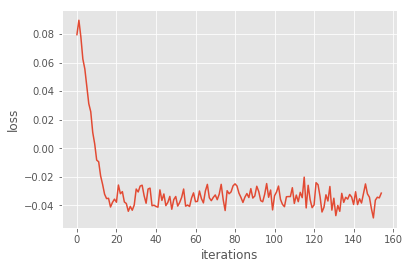
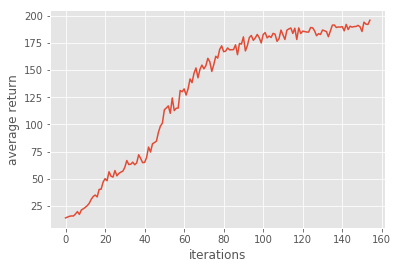
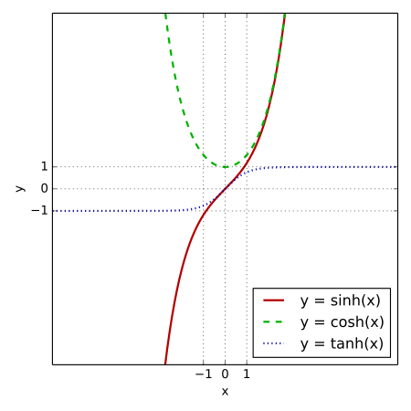

# Homework2 report
In this lab, I complete the some parts of different kinds of policy gradient. Following problems I met is what I think worth mentioned.

1. For Problem 1, I didn't notice the activation function tanh is only for the 1st layer. I set the activation of the 2rd layer as tanh, too. Although the network could still converge, it took much longer time to solve the CartPole problem. I tried several times and the shortest one is solving the problem in 120 iterations. Generally, it takes about 160 iterations to solve the problem, which is 2~3 times slower compared to 60 iterations in the correct implementation. The loss curve and average return during my first slower implementation is shown below.

This makes sense because tanh function maps the output of the second layer into (0,1), and the softmax function maps the output to (0,1) again. The relatively numerical value makes the gradient relatively smaller and thux, it takes longer time to solve the given problem.

2. Following table shows experiment results I got at last.

| Problem Num   | Algorithm           | Num of Iterations to solve the problem  |
| ---------- |:-------------:| -----:|
| 1,2,3    | with baseline in gradient estimate | 70 |
| 4	   | without baseline      |   80 |
| 5 | Actor-Critic algorithm (with bootstrapping)      |    200 |
| 6 | Generalized Advantage Estimation      |   76 |

3. Actually I found the number of iterations needed to solve the problem is unstable. Take problem 6 for example, number varies from 70 to 100 iterations. This might also depend on concrete algorithm.
