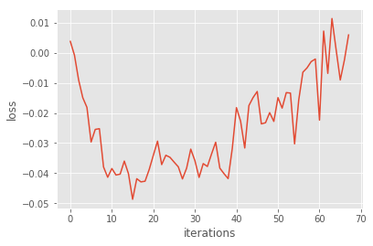
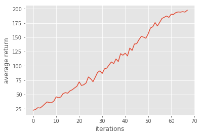
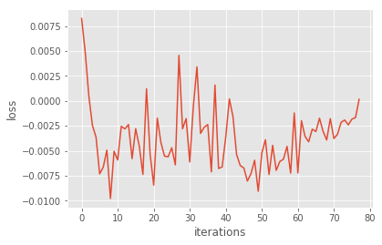
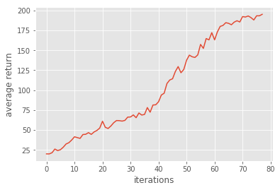
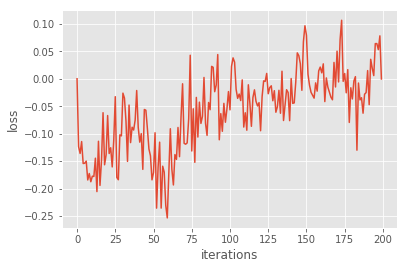
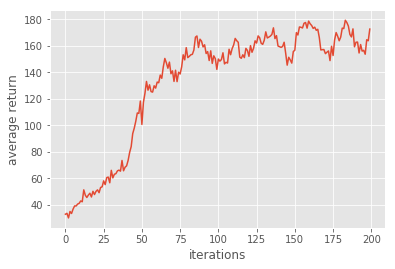
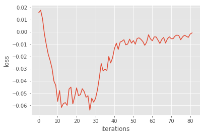
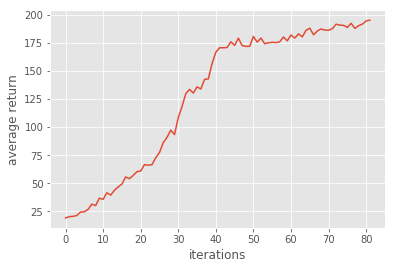

# Homework3 Report: Policy Gradient

### 106065507 徐慧文
## Overview
In this homework, we will use a neural network to learn a parameterize policy that can select action without consulting a value function. A value function may still be used to learn the policy weights, but is not required for action selection.
## Environment
* Python 3.5.3
* OpenAI gym
* numpy
* matplotlib
* ipython
* tensorflow
## Implementation
Policy gradient depends on optimizing parametrized policies with the long-term cumulative reward by gradient descent. High rewards from good actions and negative rewards from bad actions, so it will increase the probability of the good actions.

### Problem 1: construct a neural network to represent policy
We can use a neural network to output prediction of action. 
```
#fc1
layer1 = tf.contrib.layers.fully_connected( inputs =self._observations, 
                                            num_outputs = hidden_dim,
                                            activation_fn= tf.tanh 
                                          )
#fc2                  
layer2 = tf.contrib.layers.fully_connected( inputs=layer1,
                                            num_outputs=out_dim,
                                            activation_fn=None    
                                          )
        
probs = tf.nn.softmax(layer2, name='probs' )
```
### Problem 2: compute the surrogate loss
Tensorflow just has a function to minimize loss, so we should add minus to loss to achieve our goal of maximizing loss. 
```
surr_loss = -tf.reduce_mean(log_prob*self._advantages )
```
### Problem 3: Sampling-based Tabular Q-Learning
Using baseline to reduce the variance of our gradient estimate.
The advantage estimate A?t = Rt ? b(st).\
In order to reduce the variance of the gradient estimator, a constant baseline can be subtracted from the gradient.
```
a = r -b
```
The initial weight is different every time, so sometimes iteration can be within the range of 80 and sometimes it would exceed 80. 

resuts:
  <div align="center">
	
	
  </div>

### Problem 4: Compare baseline with non-baseline

add baseline:
<div align="center">
	
	
</div>


Non-baseline:
<div align="center">
	
	
</div>

The variance would be higher in the process of gradient estimate that affects the ability of learning. We make discount_rate to be smaller in the iteration that can reduce the variance, but bias will be increase.
So, we use baseline to reduce the variance of our gradient estimate without changing expectation.

<b>Why the baseline won't introduce bias?</b>

The proof as follows:

the expectation is be unchanged, in spite of the subtraction of baseline : (V represents the baseline)
<div align="center">
	
	
    
</div>

### Problem 5: Actor-Critic algorithm (with bootstrapping)
Actor is based on policy-iteration methods such as Policy Gradient, and  Critic is based on value-iteration methods such as Q-learning. Actor-Critic combines the benefits of both approaches that actor improves the current policy, and critic evaluates the current policy.

Using another method to reduce the variance:
<p>
	
</p>

```
def discount_bootstrap(x, discount_rate, b):
	b_ = np.append(b[1:], 0)
    y = np.add(x,discount_rate*b_)
    
    return y
r = util.discount_bootstrap(p["rewards"], self.discount_rate, b)
a = r -b
```

result:
<div align="center">
	
	
</div>

The result looks so bad, the iteration numbers must exceed 200. The performance of average return is unstable that the increase of value is up and down.
### Problem 6: Generalized Advantage Estimation
Here, we use a novel advantage function called "Generalized Advantage Estimation", which introduces one hyperparameter  λ to compromise the above two estimation methods.

<div align="center">
	
	
</div>

This generalized estimator of the advantage function allows a trade-off of bias and variance using the parameter 0?λ?1.

```
a = util.discount(a,self.discount_rate*LAMBDA)
```
result:


<div align="center">
	LAMBDA = 0.98
	
	  
</div>

if Lambda is too small, the estimate is just affected by near states;if it is too big, it will no make sense. 

### References

* David Silver's course
* http://kvfrans.com/the-policy-gradient/
