# 張偲宇 (106062555)

# Homework3 / Policy-Gradient report

TA: try to elaborate the algorithms that you implemented and any details worth mentioned.

## "Vanilla" Policy Gradient

### Problem 1: Construct a neural network to represent policy

> Use TensorFlow to construct a 2-layer neural network as stochastic policy.

> softmax: to get the probability of each possible action.

```
hidden_layer = tf.layers.dense(self._observations, hidden_dim, activation=tf.tanh)
probs = tf.layers.dense(hidden_layer, out_dim, activation=tf.nn.softmax)
```


### Problem 2: Compute the surrogate loss

* accumulated discounted rewards

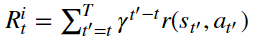

* the empirical policy gradient

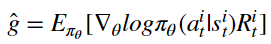

* surrogate loss

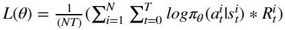

* gradient ascent

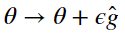

> Maximize (minimize negative) surrogate loss (locally).

> Update (good) policy based on each action log probability and the advantage function.

```
surr_loss = - tf.reduce_mean(tf.multiply(log_prob, self._advantages))
```


### Problem 3: Use baseline to reduce the variance of our gradient estimate

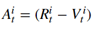

> Calculate the advantage function with the total return substract the baseline (that doesn't depend on current action).

```
a = r - b
```


* Problem 4: Compare the variance and performance before and after adding baseline

> The following statistics represent average variance of advantage (odd lines) and average return for each iteration (even lines). (only show the first and the last 5 iterations)

#### `With baseline`

+ Variance: low (lower and lower)

+ Performance of average return: smoothly increase

+ Performance of gradient: slightly change

```
57.9660667079
Iteration 1: Average Return = 28.14
19.9529704177
Iteration 2: Average Return = 26.01
19.6417168201
Iteration 3: Average Return = 29.43
23.5036562507
Iteration 4: Average Return = 30.06
18.4152287689
Iteration 5: Average Return = 29.11
...
...
1.75511975825
Iteration 61: Average Return = 193.16
2.47075777997
Iteration 62: Average Return = 188.77
1.89191193933
Iteration 63: Average Return = 194.03
0.693342883499
Iteration 64: Average Return = 194.68
0.751277729115
Iteration 65: Average Return = 196.53
```

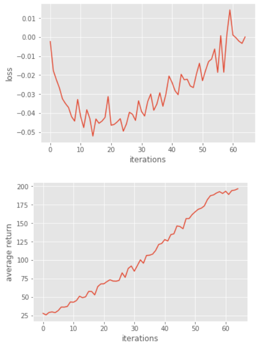

#### `Without baseline`

+ Variance: very high (higher and higher)

+ Performance of average return: unstably increase

+ Performance of gradient: significantly change

```
107.071919343
Iteration 1: Average Return = 41.73
116.660044019
Iteration 2: Average Return = 44.2
130.082543022
Iteration 3: Average Return = 48.11
135.735653374
Iteration 4: Average Return = 49.63
162.238073675
Iteration 5: Average Return = 56.89
...
...
570.511602036
Iteration 62: Average Return = 189.37
579.434552991
Iteration 63: Average Return = 193.59
580.738686323
Iteration 64: Average Return = 194.28
581.04743673
Iteration 65: Average Return = 194.74
583.390882578
Iteration 66: Average Return = 195.31
```

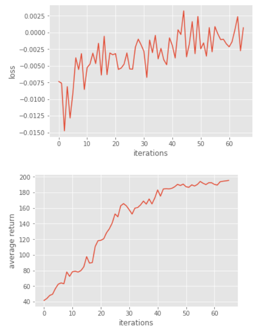


## Baseline Bootstrapping & Generalized Advantage Estimation

### Problem 5: Actor-Critic algorithm (with bootstrapping)

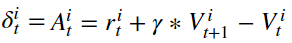

> One-step bootstrap for the advantage function.

> Calculate the advantage function with the immediate reward plus estimated baseline.

```
def discount_bootstrap(x, discount_rate, b):
	b_next = np.append(b[1:], 0) # 0: terminal state
	y = x + discount_rate * b_next # one-step
	return y
```

#### Results

+ Variance: very low

+ Performance of average return: in the beginning, quickly increase; after 50 iterations, unstably up and down

+ Performance of gradient: significantly change

```
0.0
Iteration 1: Average Return = 24.55
3.94472559859
Iteration 2: Average Return = 23.68
2.84581766411
Iteration 3: Average Return = 26.53
3.03829498641
Iteration 4: Average Return = 30.53
4.31119644444
Iteration 5: Average Return = 30.29
...
...
0.446558527303
Iteration 196: Average Return = 170.89
0.41417373788
Iteration 197: Average Return = 171.36
0.436934509236
Iteration 198: Average Return = 173.38
0.367728877293
Iteration 199: Average Return = 172.82
0.443138734512
Iteration 200: Average Return = 173.41
```

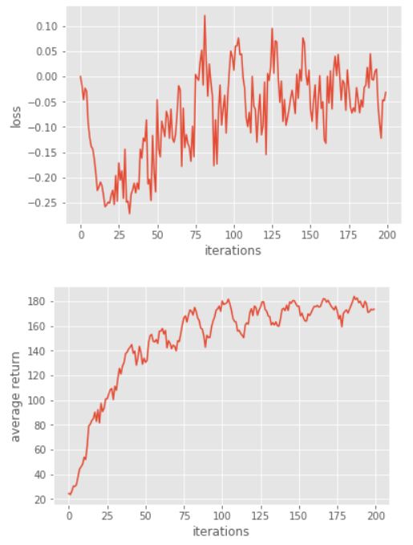


### Problem 6: Generalized Advantage Estimation

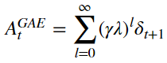

> Calculate the advantage function called `Generalized Advantage Estimation`,

> which introduces $\lambda$ to compromise the above two estimation methods.

```
a = util.discount(a, self.discount_rate * LAMBDA)
```

#### Results

+ Variance: high (higher and higher)

+ Performance of average return: quickly increase and early converge

+ Performance of gradient: slightly change

```
37.7685505016
Iteration 1: Average Return = 39.64
23.6562603871
Iteration 2: Average Return = 51.07
17.523966946
Iteration 3: Average Return = 45.27
21.9429407368
Iteration 4: Average Return = 49.73
23.1522650284
Iteration 5: Average Return = 46.74
...
...
76.0219654316
Iteration 58: Average Return = 189.49
76.4359425052
Iteration 59: Average Return = 191.59
79.8104638314
Iteration 60: Average Return = 191.48
75.6316898043
Iteration 61: Average Return = 191.9
80.1065833225
Iteration 62: Average Return = 196.41
```

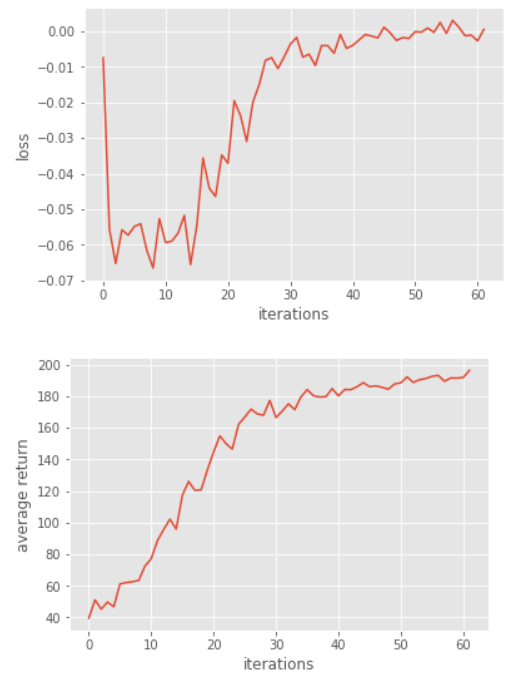
