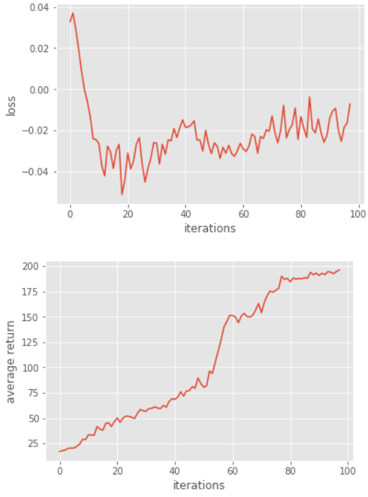
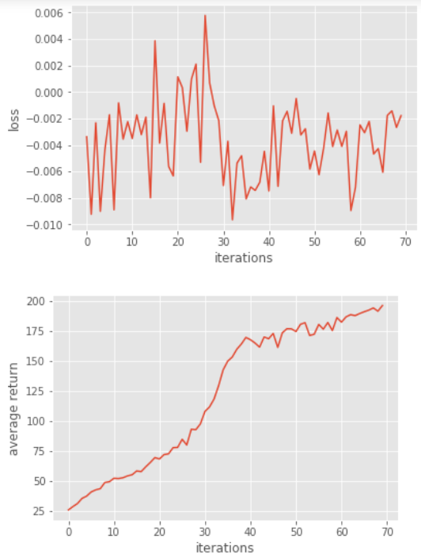
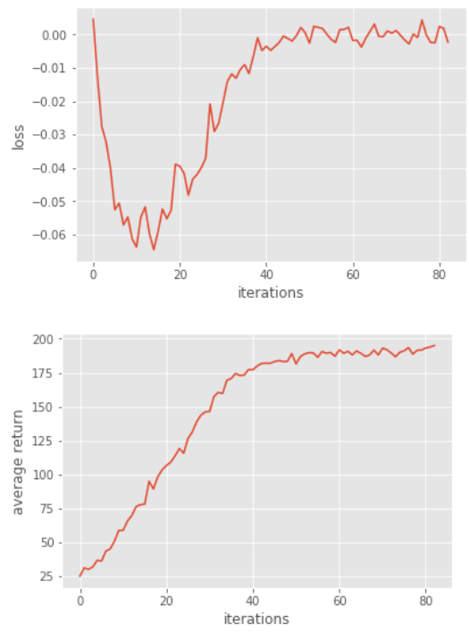
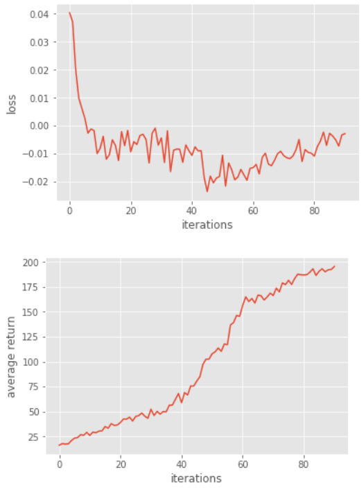

# 王智寬 (106062601)

# Homework3 / Policy-Gradient report

## Overview

In homework3, we have to solve a classic control problem - CartPole using policy gradient methods.

In Q1~Q3, "vanilla" policy gradient method is implemented.

In Q4, the baseline is removed to compare the variance and performance before and after adding baseline.

In Q5, a simple actor-critic algorithm is implemented.

In Q6, a novel advantage function called "Generalized Advantage Estimation", which introduces one hyperparameter λλ to compromise the above two estimation methods, is implemented.

## Q1 : construct a neural network to represent policy

Use TensorFlow to construct a 2-layer neural network as stochastic policy.

Assign the output of the softmax layer to the variable `probs`.

### Code 

I added 2 lines in policy.py to implement a 2 layer

<code>

        nn_activations = tf.contrib.layers.fully_connected(self._observations, hidden_dim, activation_fn=tf.tanh)
        probs = nn_activations = tf.contrib.layers.fully_connected(nn_activations, out_dim, activation_fn=tf.nn.softmax)

</code>

## Q2 : compute the surrogate loss

### Code

I added 1 line in policy.py to compute surrogate loss and assign it to variable `surr_loss`

<code>

    surr_loss = -tf.reduce_mean(log_prob * self._advantages)
    
</code>

## Q3 : Use baseline to reduce the variance of our gradient estimate

### Algorithm

### Code

I added this line in Q3

<code>

    a = r - b

</code>

### Results

<code>

    Iteration 1: Average Return = 17.06
    Iteration 2: Average Return = 17.92
    Iteration 3: Average Return = 18.64
    Iteration 4: Average Return = 20.07
    Iteration 5: Average Return = 20.47
    Iteration 6: Average Return = 20.4
    Iteration 7: Average Return = 22.16
    Iteration 8: Average Return = 24.43
    Iteration 9: Average Return = 29.07
    Iteration 10: Average Return = 28.7
    Iteration 11: Average Return = 33.5
    Iteration 12: Average Return = 33.35
    Iteration 13: Average Return = 32.99
    Iteration 14: Average Return = 41.71
    Iteration 15: Average Return = 39.15
    Iteration 16: Average Return = 37.98
    Iteration 17: Average Return = 44.73
    Iteration 18: Average Return = 45.34
    Iteration 19: Average Return = 41.76
    Iteration 20: Average Return = 46.43
    Iteration 21: Average Return = 50.12
    Iteration 22: Average Return = 45.94
    Iteration 23: Average Return = 50.01
    Iteration 24: Average Return = 51.97
    Iteration 25: Average Return = 51.74
    Iteration 26: Average Return = 50.87
    Iteration 27: Average Return = 49.55
    Iteration 28: Average Return = 54.69
    Iteration 29: Average Return = 58.53
    Iteration 30: Average Return = 57.18
    Iteration 31: Average Return = 56.81
    Iteration 32: Average Return = 59.42
    Iteration 33: Average Return = 59.57
    Iteration 34: Average Return = 61.18
    Iteration 35: Average Return = 59.9
    Iteration 36: Average Return = 59.44
    Iteration 37: Average Return = 62.48
    Iteration 38: Average Return = 60.67
    Iteration 39: Average Return = 66.51
    Iteration 40: Average Return = 69.11
    Iteration 41: Average Return = 68.53
    Iteration 42: Average Return = 70.65
    Iteration 43: Average Return = 76.02
    Iteration 44: Average Return = 71.7
    Iteration 45: Average Return = 76.81
    Iteration 46: Average Return = 77.07
    Iteration 47: Average Return = 81.04
    Iteration 48: Average Return = 79.51
    Iteration 49: Average Return = 89.55
    Iteration 50: Average Return = 84.16
    Iteration 51: Average Return = 80.47
    Iteration 52: Average Return = 81.92
    Iteration 53: Average Return = 96.41
    Iteration 54: Average Return = 93.95
    Iteration 55: Average Return = 105.44
    Iteration 56: Average Return = 116.1
    Iteration 57: Average Return = 127.03
    Iteration 58: Average Return = 139.76
    Iteration 59: Average Return = 145.1
    Iteration 60: Average Return = 151.33
    Iteration 61: Average Return = 151.18
    Iteration 62: Average Return = 149.69
    Iteration 63: Average Return = 144.09
    Iteration 64: Average Return = 150.62
    Iteration 65: Average Return = 153.24
    Iteration 66: Average Return = 150.23
    Iteration 67: Average Return = 149.7
    Iteration 68: Average Return = 151.39
    Iteration 69: Average Return = 156.74
    Iteration 70: Average Return = 163.05
    Iteration 71: Average Return = 153.86
    Iteration 72: Average Return = 164.18
    Iteration 73: Average Return = 170.84
    Iteration 74: Average Return = 175.38
    Iteration 75: Average Return = 174.19
    Iteration 76: Average Return = 176.05
    Iteration 77: Average Return = 178.08
    Iteration 78: Average Return = 189.99
    Iteration 79: Average Return = 186.79
    Iteration 80: Average Return = 187.76
    Iteration 81: Average Return = 184.48
    Iteration 82: Average Return = 188.09
    Iteration 83: Average Return = 187.13
    Iteration 84: Average Return = 187.66
    Iteration 85: Average Return = 187.55
    Iteration 86: Average Return = 188.4
    Iteration 87: Average Return = 188.04
    Iteration 88: Average Return = 193.78
    Iteration 89: Average Return = 191.37
    Iteration 90: Average Return = 193.02
    Iteration 91: Average Return = 190.74
    Iteration 92: Average Return = 192.85
    Iteration 93: Average Return = 191.42
    Iteration 94: Average Return = 194.49
    Iteration 95: Average Return = 193.93
    Iteration 96: Average Return = 192.41
    Iteration 97: Average Return = 194.62
    Iteration 98: Average Return = 196.16
    Solve at 98 iterations, which equals 9800 episodes.

</code>

## Q4 : remove the baseline

### Algorithm

After remove the baseline, we can find that the avg_return_list in each iteration between Q3 and Q4 are almost the same.

This mean the baseline won't introduce bias. But why?

The reason is pretty straightforeward when we take a closer look at the formula : ∇θJ(θ)=E{∇θlogpθ(τ)(r(τ)−b)}.

Since differentiating ∫Tpθ(τ)dτ=1 implies that ∫T∇θpθ(τ)dτ=0 , this baseline does not introduce bias in the gradient.

But the baseline can reduce the variance of the gradient estimator.

(Check the original paper for more details : https://dl.acm.org/citation.cfm?id=2074022.2074088 )

### Code

<code>

    sess.run(tf.global_variables_initializer())
    baseline = None
    po = PolicyOptimizer(env, policy, baseline, n_iter, n_episode, path_length,
                         discount_rate)

    # Train the policy optimizer
    loss_list, avg_return_list = po.train()
    util.plot_curve(loss_list, "loss")
    util.plot_curve(avg_return_list, "average return")

</code>

### Results

<code>

    Iteration 1: Average Return = 25.87
    Iteration 2: Average Return = 28.69
    Iteration 3: Average Return = 31.22
    Iteration 4: Average Return = 35.47
    Iteration 5: Average Return = 37.35
    Iteration 6: Average Return = 40.82
    Iteration 7: Average Return = 42.55
    Iteration 8: Average Return = 43.56
    Iteration 9: Average Return = 48.63
    Iteration 10: Average Return = 49.34
    Iteration 11: Average Return = 52.19
    Iteration 12: Average Return = 51.97
    Iteration 13: Average Return = 52.65
    Iteration 14: Average Return = 54.2
    Iteration 15: Average Return = 55.14
    Iteration 16: Average Return = 58.27
    Iteration 17: Average Return = 57.77
    Iteration 18: Average Return = 61.75
    Iteration 19: Average Return = 65.37
    Iteration 20: Average Return = 69.38
    Iteration 21: Average Return = 68.24
    Iteration 22: Average Return = 71.86
    Iteration 23: Average Return = 72.53
    Iteration 24: Average Return = 77.66
    Iteration 25: Average Return = 77.88
    Iteration 26: Average Return = 84.64
    Iteration 27: Average Return = 79.87
    Iteration 28: Average Return = 92.95
    Iteration 29: Average Return = 92.59
    Iteration 30: Average Return = 97.47
    Iteration 31: Average Return = 107.8
    Iteration 32: Average Return = 111.51
    Iteration 33: Average Return = 118.09
    Iteration 34: Average Return = 129.2
    Iteration 35: Average Return = 142.39
    Iteration 36: Average Return = 149.61
    Iteration 37: Average Return = 153.06
    Iteration 38: Average Return = 159.52
    Iteration 39: Average Return = 163.86
    Iteration 40: Average Return = 169.36
    Iteration 41: Average Return = 167.43
    Iteration 42: Average Return = 164.7
    Iteration 43: Average Return = 161.29
    Iteration 44: Average Return = 169.73
    Iteration 45: Average Return = 168.27
    Iteration 46: Average Return = 172.69
    Iteration 47: Average Return = 161.03
    Iteration 48: Average Return = 173.16
    Iteration 49: Average Return = 176.56
    Iteration 50: Average Return = 176.47
    Iteration 51: Average Return = 174.28
    Iteration 52: Average Return = 180.31
    Iteration 53: Average Return = 181.61
    Iteration 54: Average Return = 171.02
    Iteration 55: Average Return = 171.95
    Iteration 56: Average Return = 180.18
    Iteration 57: Average Return = 176.25
    Iteration 58: Average Return = 181.77
    Iteration 59: Average Return = 175.05
    Iteration 60: Average Return = 185.87
    Iteration 61: Average Return = 182.08
    Iteration 62: Average Return = 186.45
    Iteration 63: Average Return = 188.27
    Iteration 64: Average Return = 187.5
    Iteration 65: Average Return = 189.23
    Iteration 66: Average Return = 190.73
    Iteration 67: Average Return = 192.06
    Iteration 68: Average Return = 193.9
    Iteration 69: Average Return = 191.17
    Iteration 70: Average Return = 195.92
    Solve at 70 iterations, which equals 7000 episodes.

</code>

## Q5 : Actor-Critic algorithm (with bootstrapping)

### Algorithm

### Code

<code>

    def discount_bootstrap(x, discount_rate, b):
      rolled_b = np.roll(b,len(x)-1)
      rolled_b[-1] = rolled_b[-2]
      y = x + (discount_rate*rolled_b)
      return y

</code>

### Results

## Q6 : Generalized Advantage Estimation

### Algorithm

### Code

<code>

    a = util.discount(_a, self.discount_rate * LAMBDA)

</code>

### Results

<code>

    Iteration 1: Average Return = 16.19
    Iteration 2: Average Return = 17.73
    Iteration 3: Average Return = 17.27
    Iteration 4: Average Return = 17.58
    Iteration 5: Average Return = 20.88
    Iteration 6: Average Return = 23.24
    Iteration 7: Average Return = 23.86
    Iteration 8: Average Return = 26.7
    Iteration 9: Average Return = 26.18
    Iteration 10: Average Return = 29.01
    Iteration 11: Average Return = 26.02
    Iteration 12: Average Return = 29.3
    Iteration 13: Average Return = 28.73
    Iteration 14: Average Return = 30.3
    Iteration 15: Average Return = 30.53
    Iteration 16: Average Return = 34.96
    Iteration 17: Average Return = 33.23
    Iteration 18: Average Return = 37.78
    Iteration 19: Average Return = 36.09
    Iteration 20: Average Return = 36.46
    Iteration 21: Average Return = 38.88
    Iteration 22: Average Return = 42.47
    Iteration 23: Average Return = 42.28
    Iteration 24: Average Return = 44.32
    Iteration 25: Average Return = 40.45
    Iteration 26: Average Return = 45.03
    Iteration 27: Average Return = 45.86
    Iteration 28: Average Return = 48.52
    Iteration 29: Average Return = 45.22
    Iteration 30: Average Return = 43.18
    Iteration 31: Average Return = 52.26
    Iteration 32: Average Return = 45.94
    Iteration 33: Average Return = 50.13
    Iteration 34: Average Return = 47.33
    Iteration 35: Average Return = 49.9
    Iteration 36: Average Return = 49.69
    Iteration 37: Average Return = 56.32
    Iteration 38: Average Return = 56.39
    Iteration 39: Average Return = 62.19
    Iteration 40: Average Return = 67.95
    Iteration 41: Average Return = 58.83
    Iteration 42: Average Return = 68.92
    Iteration 43: Average Return = 66.6
    Iteration 44: Average Return = 75.6
    Iteration 45: Average Return = 75.51
    Iteration 46: Average Return = 80.57
    Iteration 47: Average Return = 84.87
    Iteration 48: Average Return = 97.23
    Iteration 49: Average Return = 102.49
    Iteration 50: Average Return = 102.52
    Iteration 51: Average Return = 107.92
    Iteration 52: Average Return = 109.87
    Iteration 53: Average Return = 113.68
    Iteration 54: Average Return = 110.35
    Iteration 55: Average Return = 117.75
    Iteration 56: Average Return = 116.95
    Iteration 57: Average Return = 136.77
    Iteration 58: Average Return = 139.09
    Iteration 59: Average Return = 146.33
    Iteration 60: Average Return = 145.49
    Iteration 61: Average Return = 156.35
    Iteration 62: Average Return = 165.03
    Iteration 63: Average Return = 160.31
    Iteration 64: Average Return = 163.36
    Iteration 65: Average Return = 158.8
    Iteration 66: Average Return = 166.69
    Iteration 67: Average Return = 166.13
    Iteration 68: Average Return = 161.82
    Iteration 69: Average Return = 164.79
    Iteration 70: Average Return = 168.67
    Iteration 71: Average Return = 166.36
    Iteration 72: Average Return = 173.77
    Iteration 73: Average Return = 169.98
    Iteration 74: Average Return = 178.94
    Iteration 75: Average Return = 177.29
    Iteration 76: Average Return = 181.56
    Iteration 77: Average Return = 177.45
    Iteration 78: Average Return = 183.33
    Iteration 79: Average Return = 187.7
    Iteration 80: Average Return = 187.14
    Iteration 81: Average Return = 186.96
    Iteration 82: Average Return = 187.25
    Iteration 83: Average Return = 189.8
    Iteration 84: Average Return = 193.15
    Iteration 85: Average Return = 186.46
    Iteration 86: Average Return = 190.7
    Iteration 87: Average Return = 193.14
    Iteration 88: Average Return = 190.15
    Iteration 89: Average Return = 192.15
    Iteration 90: Average Return = 192.53
    Iteration 91: Average Return = 195.51
    Solve at 91 iterations, which equals 9100 episodes.

</code>

