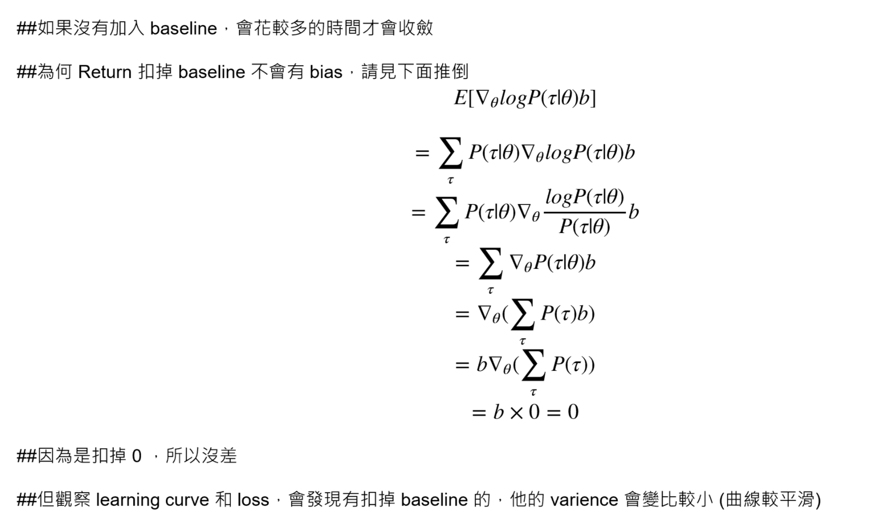

# Homework3 / Policy-Gradient report

TA: try to elaborate the algorithms that you implemented and any details worth mentioned.

### 按照 notebook 的 hint，再 trace 一下其他檔案的 code，就可以寫出來了
### 值得提的地方只有 Problem4 關於扣掉 baseline 的討論

### 有扣掉 baseline

### 沒有扣掉 baseline

