# 105061525 許菀庭
# Homework3-Policy-Gradient report

## Problem 1: Construct a Neural Network to Represent Policy

```python
hidden1 = tf.layers.dense(inputs=self._observations, units=hidden_dim, activation=tf.nn.tanh)
probs = tf.layers.dense(inputs=hidden1, units=out_dim, activation=tf.nn.softmax)
```
我用tensorflow中的tf.layers.dense來實現一個2-layer neural network。tf.layers.dense代表的就是fully-connected layer，輸入inputs、output dimension 和 activation function 就可以。這個network代表的是policy，因此inputs是observations，outputs是對應此observation，各個action的probabilities。

## Problem 2: Compute the Surrogate Loss

```python
surr_loss = -tf.reduce_mean(self._advantages * log_prob)
```
這裡實現了policy gradient的surrogate loss，計算每個episode的每個time step的 advantage * log pi(a|s)，然後取平均。因為advantage是越大越好，但optimizer是要minimize loss，所以這裡加一個負號。


## Problem 3: Reduce Variance Using a Baseline

```python
a = r - b
# a is advantages
# r is rewards
# b is baseline values
```
這個步驟把reward減掉baseline，baseline是用一個estimate的value function算出來的。這個的目的是要讓我們的model在採取一個action的reward會比baseline還高的時候，才去encourage 這個action。這麼做可以reduce variance，讓training過程更穩定。


## Problem 4: Compare the Results Before and After Adding Baseline

### 1. Why the baseline won't introduce bias

加上baseline並不會改變原本的expectation: 

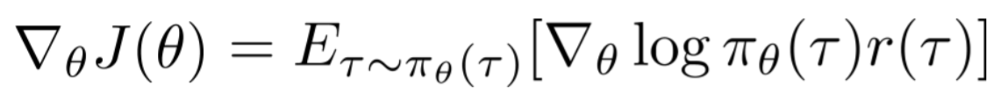

把 r 換成 r - b 之後，增加的項就是負的 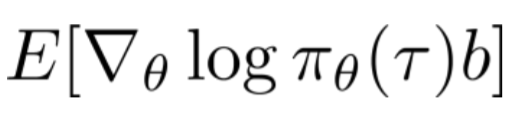

而這項的結果是0，推導如下:

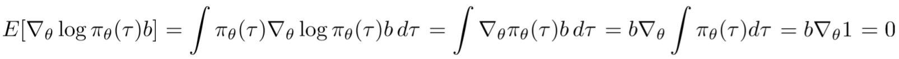

因此，加上baseline並不會造成bias。

### 2. Compare with no baseline

因為有sample的關係，每次實驗結果會有點不一樣，所以我有加baseline和沒加baseline的實驗各跑了六次，六次結果如下:

#### with baseline
<table>
  <tr>
    <td>Loss</td>
    <td>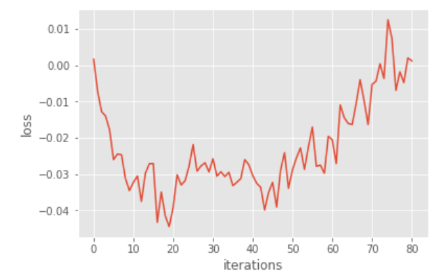</td>
    <td>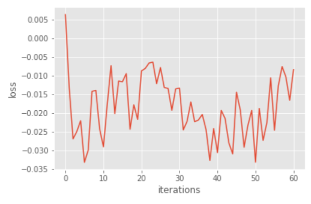</td>
    <td>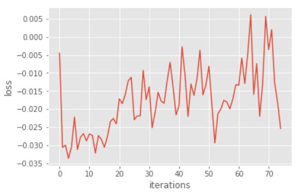</td>
    <td>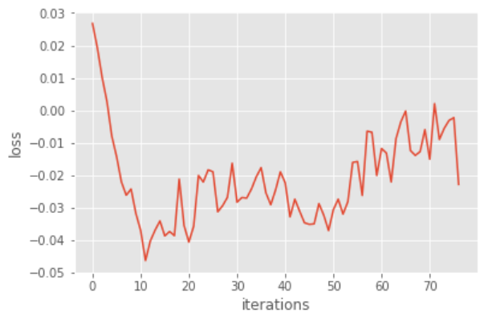</td>
    <td>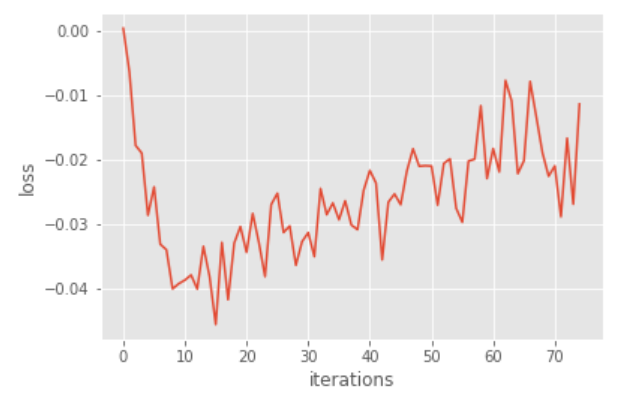</td>
    <td>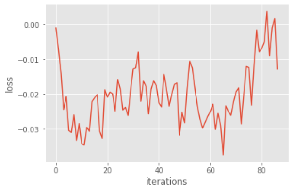</td>
  </tr>
  <tr>
    <td>Rewards</td>
    <td>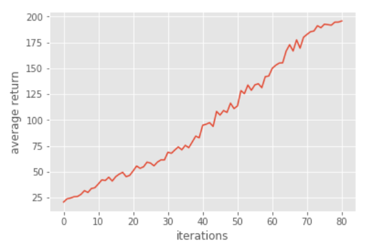</td>
    <td>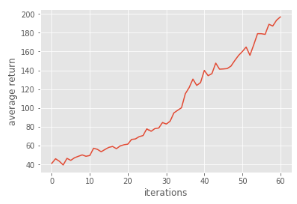</td>
    <td>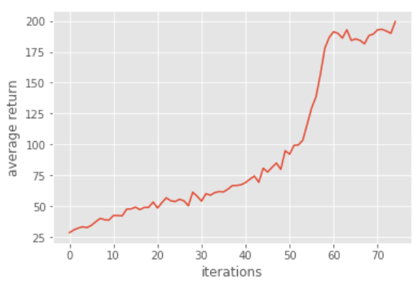</td>
    <td>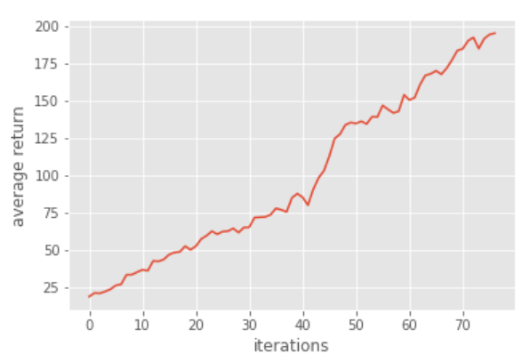</td>
    <td>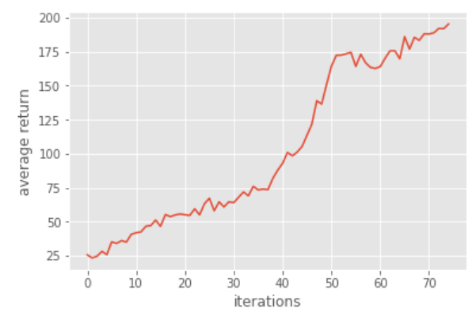</td>
    <td>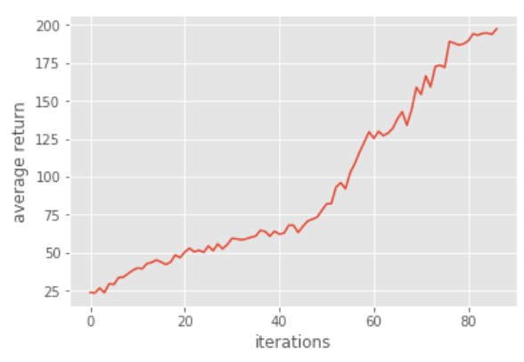</td>
  </tr>
  <tr>
    <td>Iter</td>
    <td>80</td>
    <td>61</td>
    <td>74</td>
    <td>77</td>
    <td>75</td>
    <td>86</td>
  </tr>
</table>

#### no baseline
<table>
  <tr>
    <td>Loss</td>
    <td>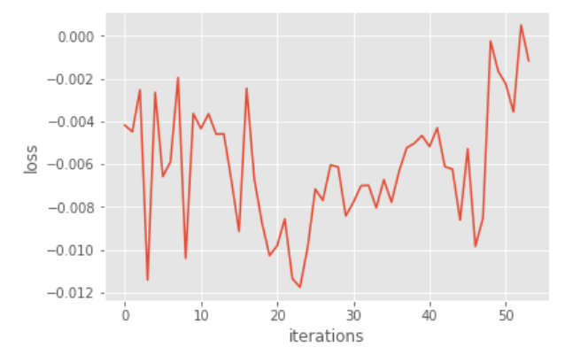</td>
    <td>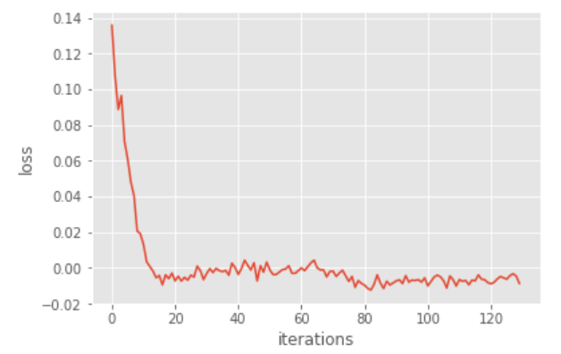</td>
    <td>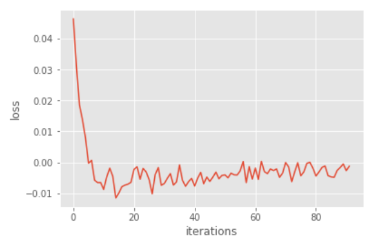</td>
    <td>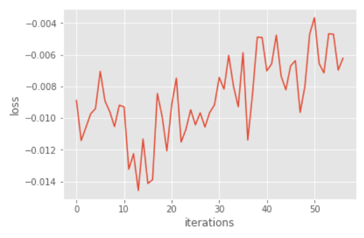</td>
    <td>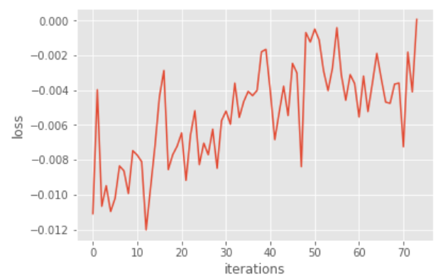</td>
    <td>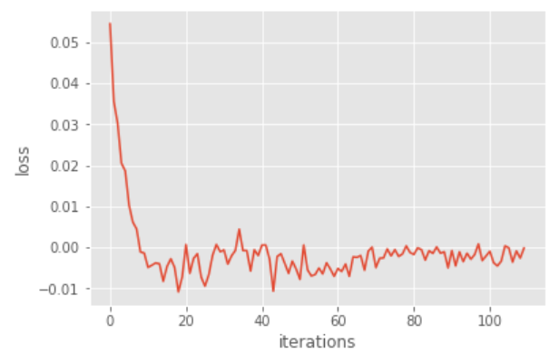</td>
  </tr>
  <tr>
    <td>Rewards</td>
    <td>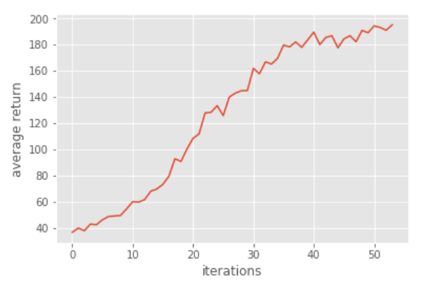</td>
    <td>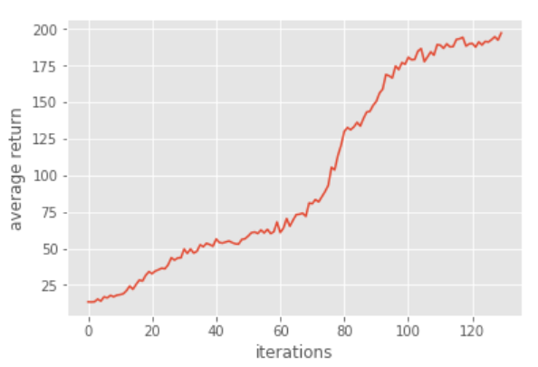</td>
    <td>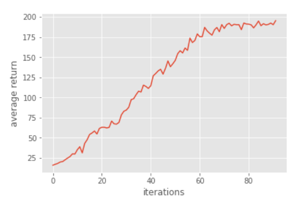</td>
    <td>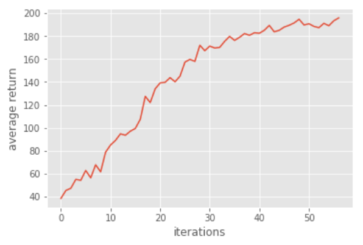</td>
    <td>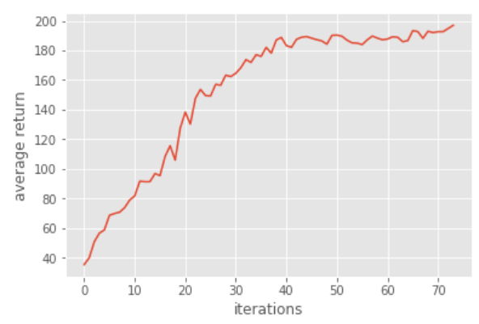</td>
    <td>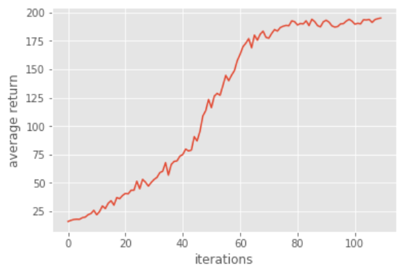</td>
  </tr>
  <tr>
    <td>Iter</td>
    <td>55</td>
    <td>132</td>
    <td>92</td>
    <td>57</td>
    <td>73</td>
    <td>109</td>
  </tr>
</table>

從上面兩個表可以觀察出以下幾點:

* no baseline的收斂速度不一定會比較慢，有的時候會很快就收斂 (e.g. no baseline的第2和第4個實驗)
* with baseline大概都花60 ~ 90個iterations；no baseline的花50 ~ 150個iterations
* with baseline收斂速度相較no baseline穩定很多，雖然no baseline在運氣好的時候可以收斂非常快，但在實驗需要很長的training time時，穩定的收斂速度會比較適合
* no baseline的rewards，到後半會上升的比較慢，有可能是variance比較大，較難找到好的actions

## Problem 5: Actor-Critic Algorithm (With Bootstrapping)

```python
b_sift = np.roll(b, -1)
b_sift[-1] = 0.0
return x + discount_rate * b_sift
```
原本在problem 1~3中，reward是計算從time step t到最後一個time step的immediate reward做discount並加總，這樣的算法bias小但variance高。
而bootstrapping是將reward改成現在這個time step的immediate reward加上discount factor乘以下個time step的value，這樣的算法variance小但bias大。

result如下:

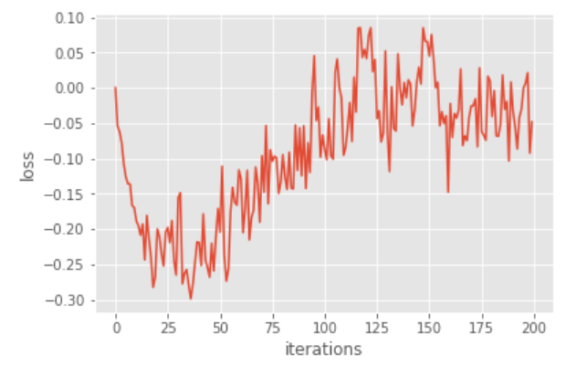 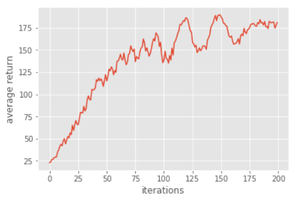

改成bootstrap的結果非常差，會一直無法收斂，我推測是因為bias高的關係。

## Problem 6: Generalized Advantage Estimation

```python
a = util.discount(a, self.discount_rate * LAMBDA)
```

GAE的算法是將前面兩種reward方式(high variance, low bias和low variance, high bias)結合。
最後結果如下:

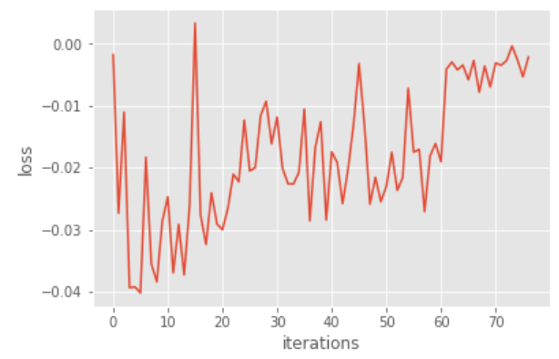 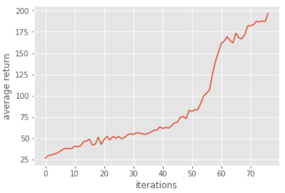
