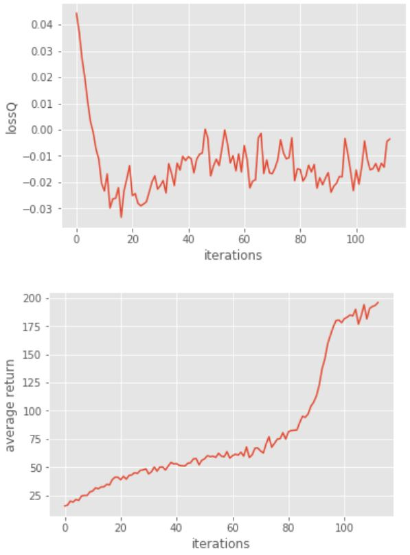
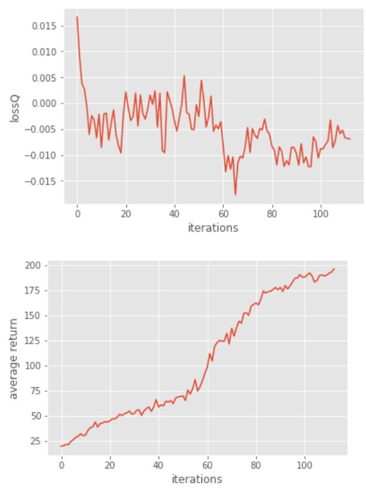
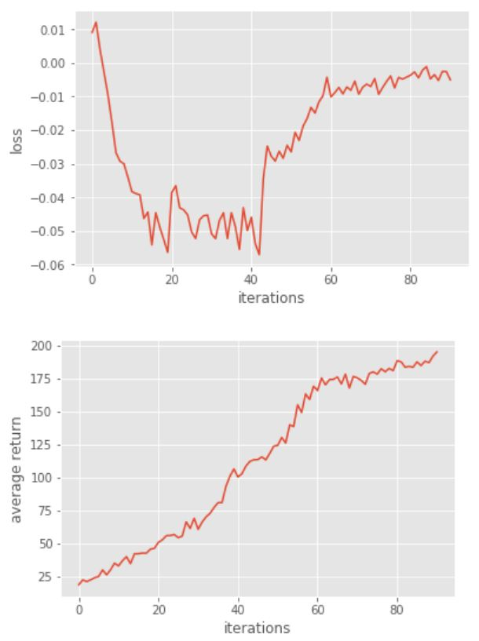

# 105061516 Homework3-Policy-Gradient report

TA: try to elaborate the algorithms that you implemented and any details worth mentioned.


## Problem 1: Construct a neural network to represent policy

```python
self.fc1 = tf.layers.dense(inputs=self._observations, units=hidden_dim, activation=tf.nn.tanh, name="fc1")
probs = tf.layers.dense(inputs=self.fc1, units=out_dim, activation=tf.nn.softmax, name="fc2")
```

> 用Fully-connected layer 建立一層隱藏層<br>
> 共 2 個 layers，上方為輸入層至隱藏層的連結，下方為隱藏層至輸出層的連結。
<br>
<br> 

## Problem 2: compute the surrogate loss

```python
loss2rew = log_prob * self._advantages
surr_loss = -tf.reduce_mean(loss2rew)
```
> 將loss乘以一個權重<br>
> 再將其轉為reward。
<br>
<br>

##　Problem 3: Compare with baseline

```python
reward compare:
  a = r - b
```

> 將訓練中得到的reward與baseline相比，得出其差異。

```python
train:
  for i in range(iteration):
    path = []
    for j in range(batch_size):
      path.append(action)
    loss = policy.update(path)
```

> 訓練由執行batch size次組成一個iteration更新policy。
<br>
執行結果:
<p align="center"></p>
<br>
<br>
## Problem 4: No baseline version

> 改為不用baseline對Loss做調整，較不穩定，需要較多iteration。
<br>
執行結果:
<p align="center"></p>
<br>
<br>
## Problem 5: Actor-Critic algorithm (with bootstrapping)

```python
r = util.discount_bootstrap(p["rewards"], self.discount_rate, b)
target_v = util.discount_cumsum(p["rewards"], self.discount_rate)
a = r - b
```

> 用 one-step bootstrapping產生reward，實現 Actor-Critic 的演算法。
<br>
## Problem 6: Generalized Advantage Estimation

```python
a = util.discount(a, LAMBDA* self.discount_rate)
```

> one-step 改為i-step bootstrapping的演算法，將最後行動的reward能影響先前行動的reward值。
<br>
執行結果:
<p align="center"></p>
<br>
<br>
