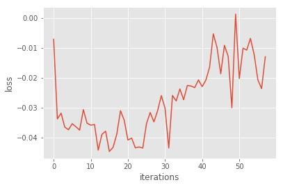
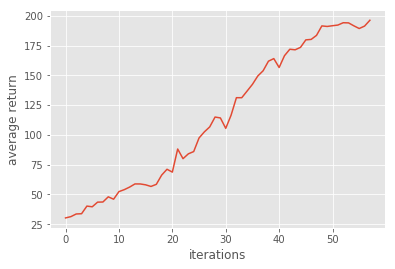
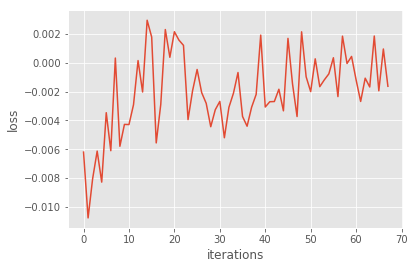
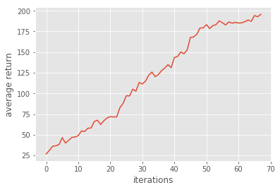
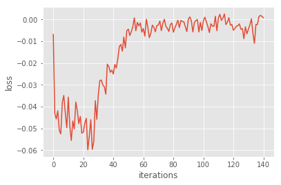
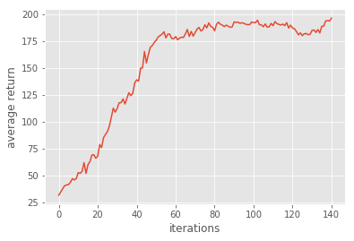
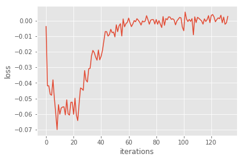
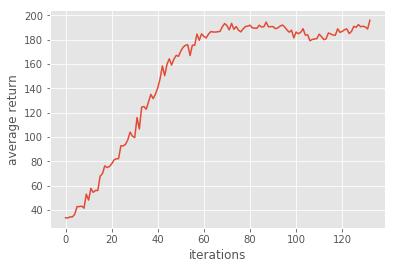

# Homework3-Policy-Gradient report

## Problem 1

The two fc-layers were constructed as follows:

```
hidden_layer = tf.contrib.layers.fully_connected(self._observations, hidden_dim, activation_fn=tf.tanh)
```
```
probs = tf.contrib.layers.fully_connected(hidden_layer, out_dim, activation_fn=tf.nn.softmax)
```

Note the little trick that the output layer was activated with `tf.nn.softmax`.

## Problem 2

Since the optimizer will minimize the given loss function, an negative symbol should be added to the surrogate loss &space;*R_t^i).

Thus, the code should be
```
surr_loss = -tf.reduce_mean(log_prob * self._advantages)
```

## Problem 3

In problem 3, a baseline predicted value was subtracted from the reward at each timestep to reduce the variance of our gradient estimate. It's could be done with a simple line code:

```
a = r - b
``` 

Variable `a` would be assigned to `data["advantages"]` after that, which was used to compute the surrogate loss.



This problem could be solved at 58 iterations.



## Problem 4

For problem 4, the vanilla policy gradient, just simply set the variable `baseline` to `None`.



It took a little more iterations (68 iterations) to solve.



## Problem 5

In problem 5 the advantage function was revised to , which was implemented as &space;-&space;V^i).

For the purpose of readability, a for-loop was used to produce the output numpy array.

```
y = np.zeros(x.shape)
for t in range(len(x)-2, -1, -1):
    y[t] = x[t] + discount_rate * b[t+1]
return y
```



This algorithm seems to be unstable, but it can still solve the problem after several attempts.



## Problem 6

The bootstrapping in **Problem 5** was multiplied by a coefficient ^l) here.

We may just call the provided function.
```
a = util.discount(a, self.discount_rate * LAMBDA)
```



It's slightly faster to solve the problem than Actor-Critic (with bootstrapping)



## Supplementary Material

I also have implemented the Monte-Carlo Policy Gradient in PyTorch.

Take a look [[here]](https://github.com/sonic1sonic/Monte-Carlo-Policy-Gradient-REINFORCE).