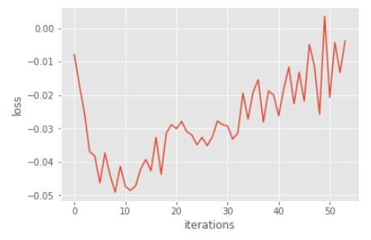
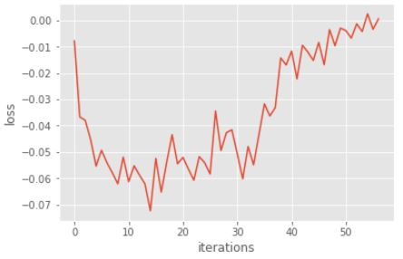

# Homework3-Policy-Gradient report
105062575 何元通  

## Introduction

&nbsp; &nbsp; &nbsp; &nbsp; In this assignment, we are asked to perform policy gradient to solve the cartpole problem. We will build a neural network to learn the parameters. And, the agent is able to select better actions without consulting a value function.

## Implementation

&nbsp; &nbsp; &nbsp; &nbsp; When implementing the functionality, what we should do is to finish the functions. All functions have been given without several critical lines of codes. Consequently, we simply need to fill in the correct codes in specific position.   
  
&nbsp; &nbsp; &nbsp; &nbsp; For the problem 1, we have to build a two-layered fully-connected neural network. I directly use the function from tensorflow package. The function is capable of building a fully-connected layer. Thus, I just call the function twice and decides its input, output dimension, and activation function. Eventually, the network will give us outputs of probability for action selection.  
  
&nbsp; &nbsp; &nbsp; &nbsp; Then, finish the loss function of the network for problem 2. I follow the loss function provided in .ipynb file. In addition, the accumulated discounted rewards have been provided and the action probabilities have been computed before as well. As a consequence, following with the formula, I add the reward vector and probability vector elementwisly and compute the mean of the addition one. It should be notice that since we would like to maximize the function, we have to multiply it with negative one.  
  
&nbsp; &nbsp; &nbsp; &nbsp; I merely follow the formulas in problem 3, that changes the loss function. Different from the original one, we substract the baseline from the rewards. And, it is similar to problem 3, I just copy all of the codes in problem 3 to problem 4 and not substract the baseline. With running results, it is much convenient for comparison.  
  
&nbsp; &nbsp; &nbsp; &nbsp; We are asked to complete a function in policy.py in problem 5. Following the hint and formulas from both .py and .ipynb files, I orinially simply multiply the baseline with discount vactor and add it with the immediate rewards elementwisly. Nonetheless, it is noticed that we should first remove the first element of the baseline and append a zero to it. As we have to give it a space for the next state and keep the size of the array. And, in problem 6, I use the discount function to compute the generalized advantage estimation with given parameters.  

## Discussion

&nbsp; &nbsp; &nbsp; &nbsp; For problem 3 and for problem 4, the main difference is the former's reward substract a baseline, but the later's is not. According to the results from the two parts, the one with baseline can converge quicklier than the one without.
  
  
&nbsp; &nbsp; &nbsp; &nbsp; As to problem 5 and problem 6, it introduces a hyperparameter lamda to improve the original policy gradient. From the discussion of my classmate and I and the data searched from Internet, we consider this change will improve the original policy gradient. It seems to update the values for each step other than updating for each round. Thus, we assume that the higher frequency it updates, the faster it converges. And, the lamda also influence the steps it considers. This may effect its speed of convergence. Moreover, as showed in the following two images. The former is the plot of problem 3 and the later is the plot of problem 6. The change of loss in problem 6 is stabler than the one in problem 3. There is much less sharp promotion or sharp drop in problem 6 contrary to problem 3. I consider this may also caused by the improvement since updating for each step can help it find a better value in local small area.  
  
&nbsp;  
  
&nbsp; &nbsp; &nbsp; &nbsp;By the way, we have also found the disadvange of it. From the data from the Internet, it tells us this algorithm is hard to converge. Of course, this happens on us that we should re-run it for several times to satisfy the request of around 80 iteration. Thus, I think this may be a crucial challenge to improve it.
