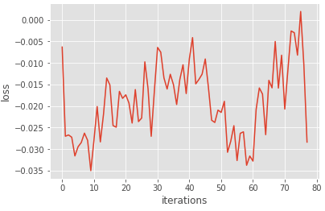
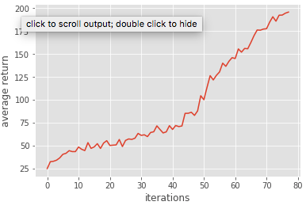
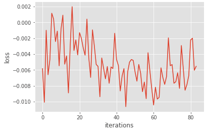
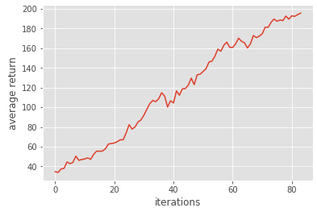
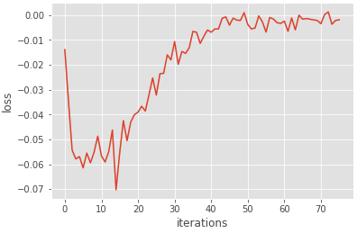
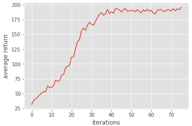

# Homework3-Policy-Gradient report

### 106062578 張益銓

## Problem 1 : construct a neural network to represent policy
In problem 1, I used dense function to build a 2 layer net.

``` tensorflow
fc1 = tf.layers.dense(self._observations, hidden_dim, activation=tf.tanh)
fc2 = tf.layers.dense(fc1, out_dim, activation=None)
```

## Problem 2 : compute the surrogate loss
I calculated the surrogate loss in this section based on the given formula. I add a minus symbal because we want to get maximum value.

``` tensorflow
surr_loss = -tf.reduce_mean(tf.multiply(log_prob, self._advantages))
```

## Problem 3 : training with baseline
Simply get a by minusing r by values predicted by our baseline
In this part, I find that loss is pretty unstable, it would not conver to a certain number. The result is shown below.
<table style="border: none !important;">
<td></td>
<td></td>
</table>

## Problem 4 : training without baseline
Training still ended up around 80 epoch. So we can say that the performance was not influenced by the baseline. Also, this experience proved that baseline won't introduce bias. The reason is that even thought we minus the r by the values predicted by real baseline, the expectation stay in the same. 
<table style="border: none !important;">
<td></td>
<td></td>
</table>

## Problem 5 : Actor-Critic algorithm (with bootstrapping)
In this part, I tried to implement another method to reduce variance. In this implementation I used one-step bootstrap for advantage function. Code is shown below.

``` tensorflow
b_roll = np.roll(b, len(x)-1)
b_roll[-1] = 0.0
y = x + discount_rate * b_roll - b
```
This is based on the formula ``` y = r(s_t,a,s_{t+1}) + gamma*V_t ```.
However, I never reach 195 within 200 epoch.


## Problem 6 : Generalized Advantage Estimation
In this part, we introduce a trade-off method to combine the above two method with giving a new variable λ.
<table style="border: none !important;">
<td></td>
<td></td>
</table>

### Reference
Lecture CS188 - <a href="https://www.youtube.com/watch?v=3aCn2-Slaoc&list=PLIeooNSdhQE5kRrB71yu5yP9BRCJCSbMt">link</a>