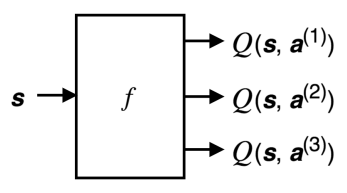
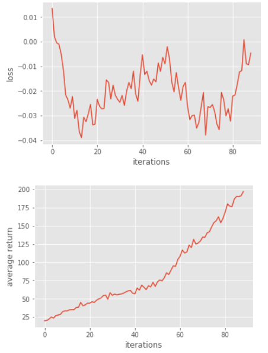
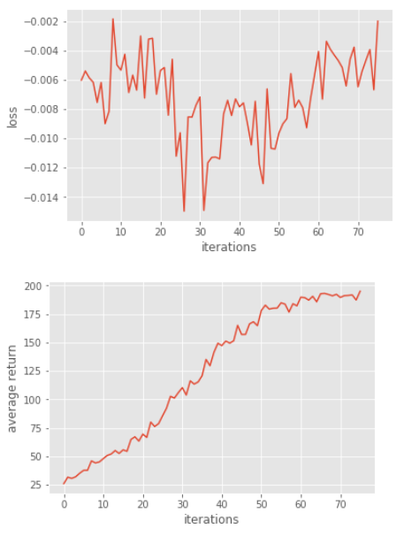
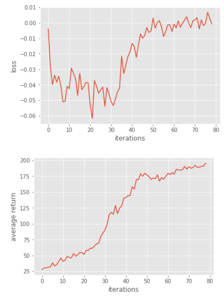

# Homework3-Policy-Gradient report
## problem1 construct a neural network to represent policy
   In more complex tasks(atari games, and even in real-world tasks), it's hard to apply policy iteration/ value iteration directly due to large state/action space, requiring large storage and hard to calculate the Q values for all. So we "learn" the Q values or plicy by neural network. Here in problem 1, we want to use a simple neural network $ f_{Q^*} (s, a;\Theta) $ to represent $ Q^* (s, a) $ where $\Theta$ is the parameters of the nerual network, just like the figure showed below:
   
   
   To implement this, I added two fully connected layers in policy.py file:
   ```python
    fc1 = tf.contrib.layers.fully_connected(self._observations, num_outputs=hidden_dim, activation_fn = tf.tanh)
    fc2 = tf.contrib.layers.fully_connected(fc1, num_outputs=out_dim, activation_fn=None)
    probs = tf.nn.nsoftmax(fc2)
    ```
   
   
   where the nn's output ```probs```(output of nn) is the logits of each action's probability conditioned on the ```self._observations```(input of nn)

## problem2 compute the surrogate loss
In reinforcement learning, our goal is to maximize the accumulated discounted reward $R_t^i = \sum_{{t^′}=t}^T \gamma^{{t^′}-t}r(s_{t^′}, a_{t^′})$ .
We want to maximize the reward, it's the same as minimize the negative reward. In problem 2 here, I added a line to compute the <b>negative</b> surrogate loss $-L(\theta) = -\frac{1}{(NT)}(\sum_{i=1}^N \sum_{t=0}^T log\pi_\theta(a_t^i | s_t^i) *R_t^i)$. and <b>minimize</b> it.

```python
surr_loss = tf.reduce_mean((-log_prob)*self._advantages)
```
## problem3 
In problem3, we're going to reduce the variance of the gradient estimate. To achieve this goal, we can change the ```Reward``` in surrogate loss into ```Reward-Basline```. This trick is somehow a similar idea with residual nets, which would help the learning more stable.
```python
a = r - b
```
## Verifying Solution
After implemented problem 1, 2, and 3, I trained my agent and got the average return curve for episodes as below:

It's clear that the reward increases during training and terminated(converged) in 83 episodes.
## problem4 compare results in problem 3 with no baseline

The results without baseline converges faster(solved in 76 iterations) than the one with baseline. It's possible that in this task, the unstable of gradient somehow pushed the agent to act like "exploration" and thus finding the solution faster than with baseline subtraction one. 
## problem5 actor-critic implementation with bootstrapping
   In Actor-Critic algorithm, actors takes actions based on policy-iteration and critics evaluates the actions based on value-iteration(Q-learning). Actor-Critic alorithm combines actor and critic where actor improves the current policy, and critic evaluates(criticizes) the current policy. Here in problem 5, we changed the advantage function in problem3 into $A_t^i = r_t^i + \gamma*V_{t+1}^i - V_t^i$ using one-step bootstrap in policy_gradient/util.py
```python
   new_b = np.append(b[1:], 0)
   return x + discount_rate * new_b
```
,which replaced the total reward by immediate reward and the estimated baseline.

The boostrapping actor-critic agent doesn't converge since it's not stable enough.

## Problem6 generalized advantage estimation (GAE)
Since the original actor-critic is not stable, in problem6, we introduce λ to compromise the advantage function based on problem3 and 5.
Assume the $\delta_t^i$ represent the i-step bootstrapping (e.g. $\delta_t^i=r_t^i + \gamma*V_{t+1}^i - V_t^i$). The generalized advantage estimation will be:

$$A_{t}^{GAE} = \sum_{l=0}^{\infty} (\gamma\lambda)^l \delta_{t+1}$$

Here we use ```util.discount``` to calculate the advantages by discount_rate and LAMBDA

```python
a = util.discount(a, self.discount_rate * LAMBDA)
```
The GAE agent converged in 73 episodes.
