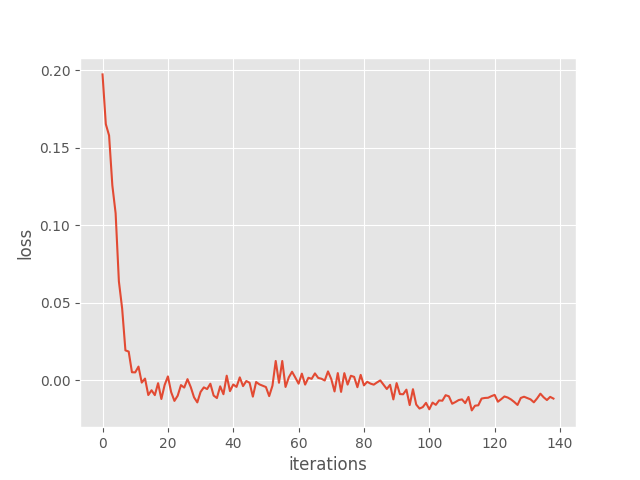
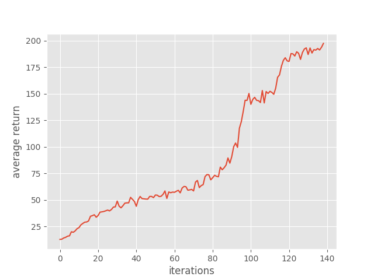
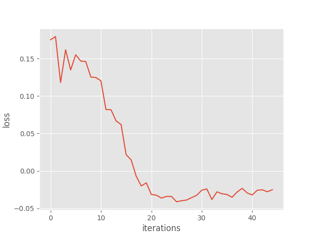
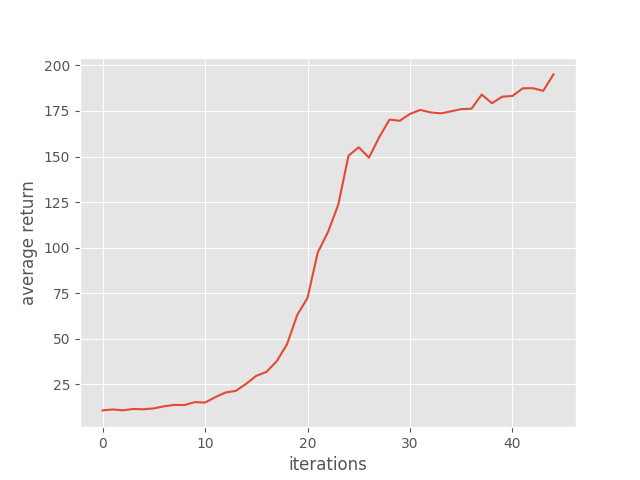
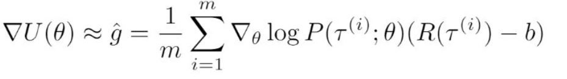
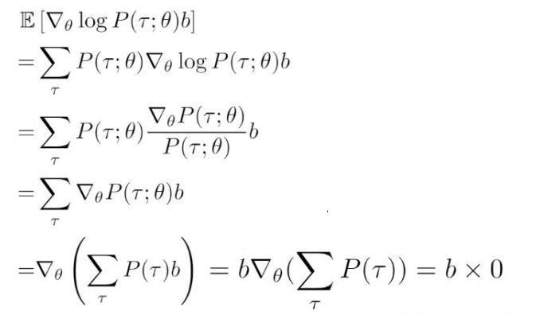

# Homework3-Policy-Gradient report

### 105061528 陳玉亭

### Overview:
>This homework is about policy gradient. Based on policy gradient, Actor-Critic algorithm and Generalized Advantage Estimation (GAE) methods are  extensions.

#### For problem.4, compare reducing baseline results wih not do this:
**Without baseline:  **

  
**With reducing baseline:  **

  
See lower variance in reducing baseline results (smooth curves). For reducing baseline, it achieve successful performance early (from Retrun figures). 

**explain why the baseline won't introduce bias:**  
If we take gradient on the policy loss with baseine reduction, we can observe:  
  
We know the first term grad(logP*R) has no bias. Then, for the last term, that can be derived:  
, which shows no bias included.

 

  

 
