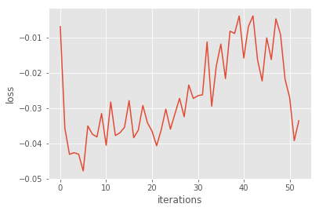
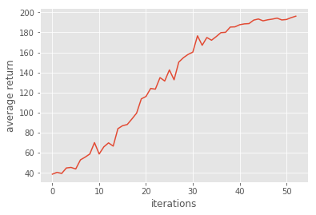
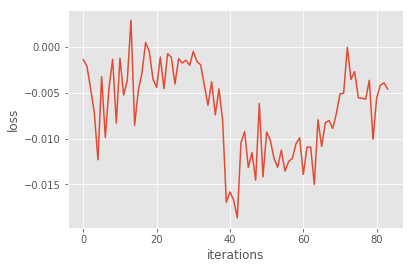
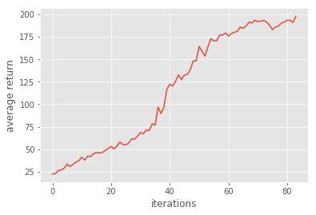
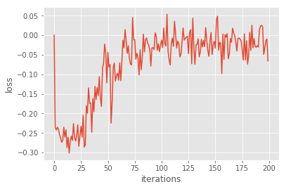
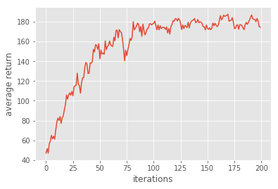
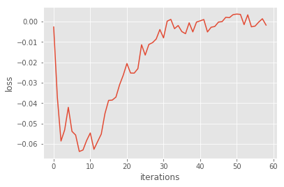
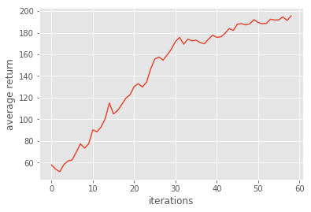

# Homework3-Policy-Gradient report

## Problem1 - construct neural network
We can simply construct a 2-layer neural network with following lines:
```
fc1 = tf.layers.dense(self._observations, units=hidden_dim, activation=tf.nn.tanh)
fc2 = tf.layers.dense(fc1, units=out_dim, activation=None)
        
probs = tf.nn.softmax(fc2)
```
## Problem2 - compute the surrogate loss
In this section, we want to maximize surrogate loss, that is, minimize the negative of surrogate loss function (Since tensorflow optimizer always minimize the cost):
```
surr_loss = -tf.reduce_mean(log_prob * self._advantages) 
```
## Problem3 - Use baseline to reduce the variance of our gradient estimate
In problem3, we use baseline prediction to reduce the variance of gradient estimate. So, we can simply substact the baseline predict value from the reward in following line:
```
a = r - b
```

After we finish problem 1~3, we can solve carpole problem in ~60 step, following is the results:  
<table border=1>
<tr>
<td>


</td>
</tr>
</table>

## Problem4 - Compare with and without baseline
If we do policy gradient without baseline prediction to help us reduce the variance, we may get result like this:
<table border=1>
<tr>
<td>


</td>
</tr>
</table>
Compare with results in problem3, we can clearly observe that the variance become large, but it still can reach the goal at ~80 iteration which is worse than the performance in problem3 with baseline.

Another question is **why the baseline won't introduce bias?**  
We may refer to material in CS294, see following formula

we can find that baseline is unbiased in expectation, that is become 0.

## Problem 5 - Simple Actor-Critic
In this section, we'll implement a simple actor-critce method by replacing the advantage function to **one-step bootstrap**:
```
_b = np.append(b[1:], 0) # because we need next time-step's value

return x + discount_rate * _b
```
We can get result:

<table border=1>
<tr>
<td>


</td>
</tr>
</table>
However, we cannot get 195 scores in only ~80 step, maybe it need more iterations to learn.

## problem6 - Generalized Advantage Estimation
In this section, we implement GAE by introducing one hyperparameter LAMBDA to compromise the method metioned in problem3 and problem5, by simply adding one line:
```
a = util.discount(a, self.discount_rate * LAMBDA)
```
And we get really good result which reach our goal in only 59 steps:
<table border=1>
<tr>
<td>


</td>
</tr>
</table>
