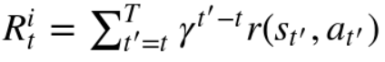
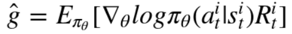
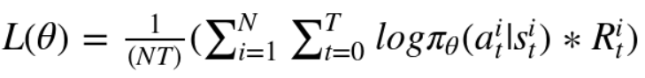
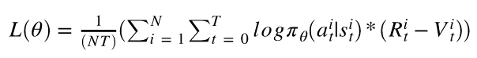
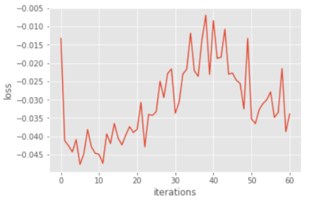
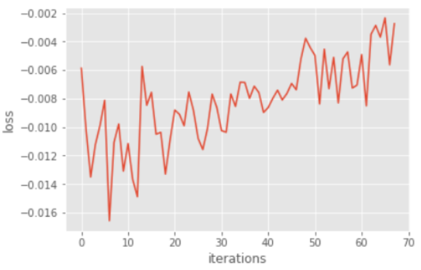
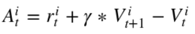
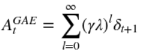
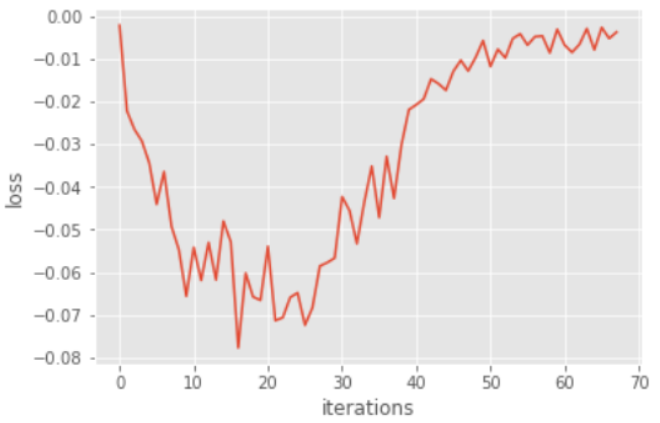

# Homework3 report: Policy-Gradient 
## 靳文綺 <span style="color:red">(106062563)</span>

## Overview
In this homework, there are mainly six problems that we want to solve using policy gradient:
* <b>Problem 1~3: To implement the policy gradient method.</b> 
	* Problem 1: Construct a neural network to represent policy. 
	* Problem 2: Compute the surrogate loss. 
	* Problem 3: Use baseline to reduce the variance of our gradient estimate.
* <b>Problem 4: Modify the code to compare the variance and performance before and after adding baseline.</b>
* <b>Problem 5: To implement the Actor-Critic algorithm (with bootstrapping).</b>
* <b>Problem 6: To implement the Generalized Advantage Estimation.</b>


## Installation
* Python 3.6.2
* tensorflow
* numpy
* matplotlib
* ipython
* [OpenAI gym](https://github.com/openai/gym)
	```
	pip install gym
	```
	
	
## Detail
### Problem 1. Construct a neural network to represent policy
<b> homework3-policy-gradient/policy_gradient/policy.py </b> <br/>
Construct a 2-layer neural network as stochastic policy using tensorflow.

#### code
======
```
# 1st hidden layer: define weight and bias 
w_layer1 = tf.Variable(tf.truncated_normal([in_dim, hidden_dim], stddev=1.0/math.sqrt(float(in_dim))))
b_layer1 = tf.Variable(tf.zeros([hidden_dim]))

# softmax layer: define weight and bias  
w_softmax = tf.Variable(tf.truncated_normal([hidden_dim,out_dim],stddev=1.0/math.sqrt(float(hidden_dim))))
b_softmax = tf.Variable(tf.zeros([out_dim]))

# 1st hidden layer: fully-connected layer, size = hidden_dim, activation function = tanh
layer1 = tf.tanh(tf.matmul(self._observations,w_layer1)+b_layer1)

# Assign the output of the softmax layer to the variable 'probs'
probs = tf.nn.softmax(tf.matmul(layer1,w_softmax)+b_softmax)
```


### Problem 2. Compute the surrogate loss
#### algorithm
======
* <b>accumulated discounted rewards</b> (from timestep 't' to the end of that episode)


* <b>the empirical policy gradient</b>


* <b>the surrogate loss</b>


#### code
======
```
# self._advantages : accumulated discounted rewards from each timestep to the end of an episode
# log_prob : log(pi(a|s)) for all timestep
# surr_loss : the surrogate loss

surr_loss = tf.reduce_mean(tf.mul(log_prob,self._advantages))*(-1)
```


### Problem 3. Use baseline to reduce the variance of our gradient estimate
#### algorithm
======
Change the surrogate loss into:


#### code
======
```
# b : the reward predicted by our baseline

a = r - b
```

#### results
======
<div align="center">


</div>


### Problem 4. Modify the code to compare the variance and performance before and after adding baseline
#### results
======
<b> With baseline </b>
* the average return: smoothly increase

<div align="center">


</div>

<b> Without baseline </b>
* the average return: unsmoothly increase

<div align="center">


</div>


### Problem 5. To implement the Actor-Critic algorithm (with bootstrapping)
#### algorithm
======
Using the one-step bootstrap for the advantage function


#### code
======
```
def discount_bootstrap(x, discount_rate, b):
	roll_b = np.roll(b,len(x)-1)
	roll_b[-1] = 0
	y = x + (discount_rate*roll_b)
	return y
```


### Problem 6. To implement the Generalized Advantage Estimation
#### algorithm
======
The generalized advantage estimation will be:


#### code
======
```
a = util.discount(a, self.discount_rate * LAMBDA)
```

#### results
======
* the average return: irregular increase
<div align="center">


</div>