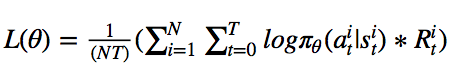
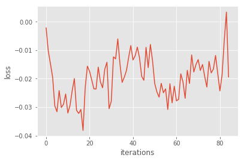
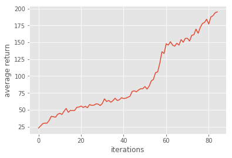
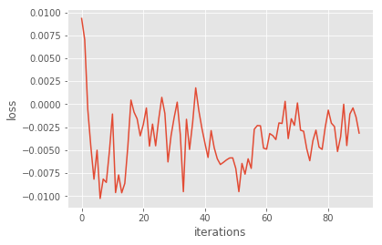
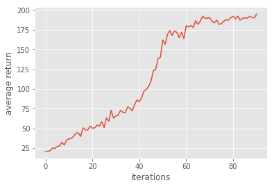
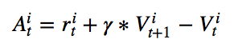
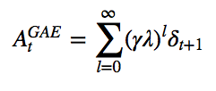
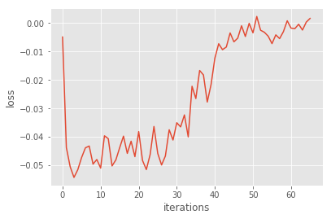
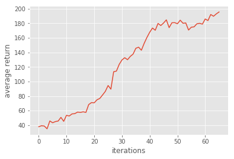

# Homework3-Policy-Gradient report


1. Problem 1: construct a neural network to represent policy
```
hidden_out = tf.layers.dense(self._observations, hidden_dim, tf.nn.tanh)
probs = tf.layers.dense(hidden_out, out_dim, tf.nn.softmax)
```
2. Problem 2: compute the surrogate loss 
```
surr_loss = -tf.reduce_sum(tf.multiply(log_prob, self._advantages))/tf.to_float(tf.shape(self._advantages))
```
3. Problem 3: use baseline to reduce the variance
```
a = r - b
```
  * results: 85 iterations
  
  
  
4. Problem 4: remove the baseline
  * results: 91 iterations
  
  
  
  * removing the baseline: higher variance and worse performance
  * subtracting baseline won't introduce bias because subtracting a constant from an unbiased estimator doesn't introduce bias.
  
5. Problem 5: Actor-Critic algorithm (with bootstrapping)
  * 
```
b_ = np.roll(b, -1)
b_[-1] = 0
y = x+discount_rate*b_
return y
```
6. Problem 6: Generalized Advantage Estimation
  * 
```
a = util.discount(a, self.discount_rate*LAMBDA)
```
  * results
  
  
