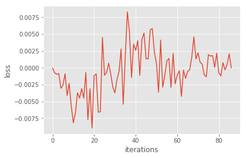
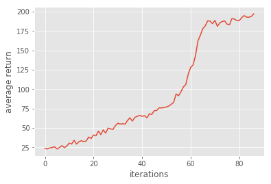
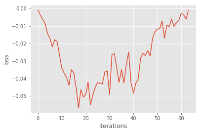
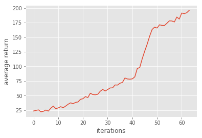

# Homework3-Policy-Gradient report

## Problem 1~3
加入 baseline 是因為怕若我們的 reward 全為 positive or negative 的話，那好的或壞的路徑軌跡概率就會一起增加或一起減少了，
所以要給梯度一個可以調整的 baseline， reward 超過 b 的增加概率，反之則減少。
<table border=1>
<td>

</td>
</table>

## Problem 4
若沒有baseline，則在訓練過程中會產生剛剛上面提到過的問題，導致 variance太大 LOSS變化幅度很大以至於不好收斂。
<table border=2>
<td>

</td>
</table>

## Problem 5
此方法是利用 value-based的方法來對值函數進行估計來減少 variance，跟上面的差異是在於 baseline變為該狀態下所有路徑的未來獎勵期望的平均值，
因為 pass reward 不應該影響到 future action。
<table border=3>
<td>

</td>
</table>

# Problem 6
GAE是根據之前的方法再做修改，他是希望利用兩個可調的變數給予各步估計的加權平均來達到:在控制 bias的情況下降低 variance。
<table border=4>
<td>

</td>
</table>
