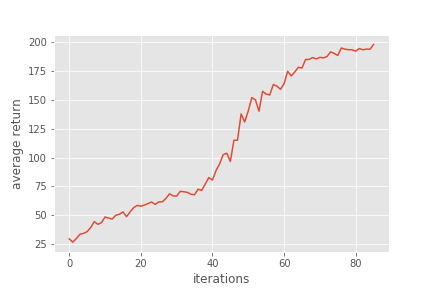
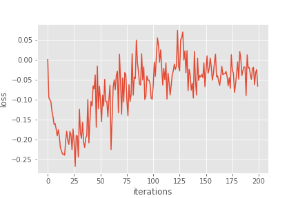

# 106061532洪彗庭 CEDL-hw3

In this assignment, we are going to solve a classical control problem -- CartPole, using policy gradient approach.

## Setup
Simply follow the instructions from TA, like follows:

```
conda env create -f environment.yml
source activate cedl
# deactivate when you want to leave the environment
source deactivate cedl
```

## CartPole
Unlike previous MDP problrms we have seen, whose definition of all state transition probability are pretty clear, the CartPole control problem is more like a real world problem, which means that we don't want to put effort on defining all these environment information since it's too complicate. We simply base on a **model-free reinforcement learning** idea to solve this problem.
 
Simple description of CartPole: </br>


**- Goal** : Keep the pole not falling </br>
**- Rule** : The pole is sticked to a cart, and we can move the cart toward left or right (+1, -1), in order to prevent the pole fall.</br>
**- Reward** : Always 1 in every time step</br>
**- End** : When the the pole is more than 15 degrees from vertical, or the cart moves more than 2.4 units from the center.

The following will describe a standard way of policy gradient approach, and 2 improvements of policy gradient, which are Actor-Critic algorithm and the GAE approach respectively.

### 1. "Vanilla"(standard) policy gradient approach

Recall that in the previous classical MDP problems, we can solve by value iteration or policy iteration, when we go further to address model-free problem, we still need the **action-state value function** ( **q(s,a)** ) to help us solve the problem no matter using sarsa(lambda) or Q-learning (We store q(s,a) like a table or 2-dim matrix). </br></br>
However, our problem in this stage is quite complicate, and it wouldn't make any sense if we still use the action-state value function in a table look-up way, **we want to parameterized it!** That is the idea of policy gradient came from. In other words, we want to find a direct mapping function (suppose θ as our parameter) from our state-action to the reward, and hopefully it is differentiable so we can update the θ in an efficient way which can then be used to help us to find the best policy. </br></br>
 
#### 1-1. Basic Idea
The formula of policy gradient is described clear in the [code](./Lab3-policy-gradient.ipynb) by TA, I will simply point out the conclusion. The policy gradient formula is like this:
</br></br>
</br></br>
which : &nbsp;&nbsp;&nbsp;&nbsp;
&nbsp;&nbsp;&nbsp;&nbsp; is called the surrogate loss, and it is actually the result of taking the expectation of log(pi)*q(s,a).
</br></br>
The way we parameterize the policy is using a 2-layer shallow neural network, and later base on the formula to calculate the surrogate loss(We use the reduce_mean function to implement it). Code detail please refer to [policy.py](./policy_gradient/policy.py). </br></br>

#### 1-2. Adding the idea of baseline
The idea of substracting the baseline from the policy gradient is that we care about the **relative different** instead of the actual q-value(Big capital R in this case) we get. For example if we got R = 10001 this time while got R = 9999 in the next time, then base on the policy gradient formula, we will update our theta in proportion to ∇(10001) this time and update our theta in proportion to ∇(9999) next time. However, it is obvious that in this way, the updated direction varies a lot! What we really want is update our theta in proportion to ∇(1) this time and update our theta in proportion to ∇(-1) next time for example. That is the idea of baseline come from, in other words, we **rescale our reward** in order to decrease the variance of our estimation. </br></br>
One good choice of baseline function is actually the state-value function, **V**. The reason is that we can interpret the state-value function as the **average or usual reward** we got, and by substracting the state-value function from the policy gradient, we can have a conept of **how much more reward we can get with respect to the usual reward** base on the certain sampled policy.</br></br>
The result are as follows:</br>
<div align="center">


</div>

To know more details please refer to the [code](./Lab3-policy-gradient.ipynb)</br></br>

#### 1-3. Why baseline won't introduce bias

The idea is that we want to **reduce the variance** but we **don't want to change the expectation result**.(Described in the **Basic Idea Part** above, which the surrogate loss is actually the result of taking the expectation of log(pi)*q(s,a)). If the baseline function can remain the expectation in the same value, then we can comfirm that by substracting the baseline from the policy gradient, we can not only reduce variance but also make sure the bias didn't increase. In other words, we want to see the following equation: </br></br>


which B(s) is the baseline function. The proof is as follows:</br></br>
</br>
</br></br>
now we focus on the latter part in the above equation,</br>

</br></br>
</br>
</br>
</br>
</br>
</br>
</br>
</br>

Finally, we proove that :</br></br>
</br>
</br>
</br>
</br>

Now we can see that by substracting **a zero-expection baseline function** from the policy gradient, we can **not only reduce variance but also remain the same bias**.
</br>

[note]: the above proof are mainly come from the slides of Davis Silver RL-course in lecture 7. [link](http://www0.cs.ucl.ac.uk/staff/d.silver/web/Teaching_files/pg.pdf)</br></br>

#### 1-4. Compare the result before and after adding the idea of baseline

The result before adding the idea of baseline: </br>

<div align="center">


</div>


The result after adding the idea of baseline: </br>

<div align="center">


</div>

We can see from the above figure that the oscillation of loss in "before adding the idea of baseline" is quite strong than the result "after adding the idea of baseline". This means that the variance of the result without baseline is large than the result with baseline. </br></br>
The reason is that after we substracting the baseline from the policy gradient, we somehow **rescale the reward**. Just like the example I mentioned above in the **"1-2. Adding the idea of baseline"** part, if we didn't apply baseline, each time the direction we update would possibly be a pretty large amount (e.g. proportion to ∇(10001)), and that is where the variance comes from.</br>To know more details please also refer to the [code](./Lab3-policy-gradient.ipynb)</br></br>
### 2. Actor-Critic algorithm

The idea of Actor-Critic algorithm can be divided into 2 parts, one is **Actor** the other is **Critic**. Basically, the Actor will update the parameter base on the advice given by the Critic. We can write the idea as follows : </br></br>
critic: update w </br>
</br></br>
actor : update θ </br>


where the ϕ(s, a) is just the linear function approximation of Q(s, a), and α, β are just the constant. And δ is the same as the definition in problem-6.

Here we know that our advantage function is using the idea of bootstrapping, however, in this problem, I feel like it's pretty easy to sample out some policies which are really bad. Therefore, if we use the bootstrap approach, it seems that it need more iteration to achieve the reward over 195. (So far it can't reach 195 within 200 iterations)</br>

The result are as follows:</br>
<div align="center">


</div>


To know more details please also refer to the [code](./Lab3-policy-gradient.ipynb)

### 3. Generalized Advantage Estimation

The GAE is defined as the weighted average of the advantage estimation, which the formula is as follows: </br>


</br></br>
the delta function here is the discounted sum of TD(Temporal Difference) residuals, which is written as : </br>


I feel like the idea of GAE is actually trying to keep the advantage of bootstrapping (**low variance**) but also want to achieve **unbias** by accumulating the true reward we got from further time-step after the current state. The value of lambda is the same as the idea in [TD(λ)](http://www0.cs.ucl.ac.uk/staff/d.silver/web/Teaching_files/MC-TD.pdf), which the larger the λ is, the more we trust on further time-step reward we get. One thing need to notice is that TD(0) could be seen as pure bootstrap algorithm and its formula is pretty similar to our δ here(without substracting the baseline).

The result are as follows:</br>
<div align="center">


</div>

To know more details please also refer to the [code](./Lab3-policy-gradient.ipynb)


## Reference
* A pretty nice [explanation of GAE](http://www.breloff.com/DeepRL-OnlineGAE/) written by [Thomas Breloff](https://github.com/tbreloff).
* [Another implementation](https://chenrudan.github.io/blog/2016/09/04/cartpole.html) of Cartpole control problem.
* Also [another implementation](https://gist.github.com/mohakbhardwaj/3bdc75f76e51037f479160ad9d019b7a) of CartPole control problem.
* Also [another implementation](https://gist.github.com/domluna/529d3e7b51fe7e2589be71dd9d2ace4e) of CartPole control problem.
* Lecture 4,5,6,7th of RL from Davis Silver. [link](https://www.youtube.com/watch?v=KHZVXao4qXs&t=4851s)
* [Important Sampling](https://en.wikipedia.org/wiki/Importance_sampling)