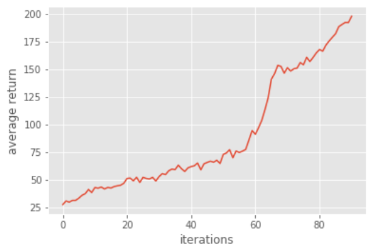
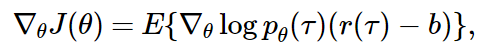

# Homework3-Policy-Gradient report

## Overview
> In this homework, we implement policy gradient to solve CartPole.

This homework is divided to six problems:
* Problem 1: Construct a neural network to represent policy
* Problem 2: Compute the surrogate loss
* Problem 3: Reduce the variance of the gradient estimation
* Problem 4: Remove baseline
* Problem 5: Actor-Critic algorithm
* Problem 6: eneralized Advantage Estimation


## Problem 1: Construct a neural network to represent policy
Create a <b>2-layer neural network</b> for policy by tensorflow. 
The hidden layer is fully connected and use `tanh` as the 
activation function of the first layer. Then output with softmax layer. 

* <b>Code</b>

	```python
	hidden_layer1 = tf.contrib.layers.fully_connected(self._observations, hidden_dim, activation_fn=tf.tanh)
	hidden_layer2 = tf.contrib.layers.fully_connected(hidden_layer1, out_dim, activation_fn=None)
	probs = tf.nn.softmax(hidden_layer2)
	```

## Problem 2: Compute the surrogate loss
* <b>surrogate loss</b>

<p align="center"></p>

* <b>Code</b>

	We have `log_prob` ( log ) and `self._advantages` ( R ). 
	We then compute the surrogate loss by multiply them. 
	And we add minus to get the maximization since the tf.optimizer does the minimization.

	```python
	surr_loss = -tf.reduce_mean(tf.multiply(log_prob, self._advantages))
	```

## Problem 3: Reduce the variance of the gradient estimation
We use <b>baseline</b> to reduce the variance of our gradient estimation.

* <b>baseline</b>

<p align="center"></p>

* <b>Code</b>

	We have `b`(baseline) and `r`(reward). 
	So we reduce the variance by `r - b` and assign to `a`.

	```python
	a = r - b
	```

* <b>Result</b>

	The number of the iteration is different every time. 
	(According to my results, most of the time the number exceeds 80)
	 
	<b>Iteration: 78</b>

	<div align="center">
		
		
	</div>

	<b>Iteration: 91</b>

	<div align="center">	
				
				
	</div>


## Problem 4: Remove baseline
Comparing the variance and performance with adding baseline and removing baseline.

From the results below, we can see that removing baseline makes the variance become larger. 
And in the middle of the polyline, the trend is first going down and then going up, 
which is quite different from the one adding baseline (first go up and then go down).

Most of the time removing baseline has fewer iteration than adding baseline.

* <b>Result</b>

	<b>Add baseline</b> (`baseline = LinearFeatureBaseline(env.spec)`)
	<div align="center">
		
		
	</div>

	<b>Remove baseline</b> (`baseline = None`)
	<div align="center">
		
		
	</div>

---
<b>Why the baseline won't introduce bias?</b>

In order to reduce the variance of the gradient estimator, 
a constant baseline can be subtracted from the gradient,
<p align="center"></p>

To show that this baseline does not introduce bias in the gradient as differentiating 
<p align="center"></p>
implies that
<p align="center"></p>

Hence, the constant baseline will vanish for infinite data 
while reducing the variance of the gradient estimator for finite data.

*Reference: [Policy gradient methods]*(http://www.scholarpedia.org/article/Policy_gradient_methods)


## Problem 5: Actor-Critic algorithm (with bootstrapping)
We change the advantage function in Problem 3 into the function below, using <b>one-step bootstrap</b>.

* <b>One-step bootstrap</b>

<p align="center"></p>

* <b>Code</b>

	We replace the total return with immediate reward and estimated baseline. 

	```python
	b_next = np.append(b[1:], 0)
	y = x + discount_rate * b_next
	```

* <b>Result</b>

<p align="center">
	
	
</p>

## Problem 6: Generalized Advantage Estimation
We use the previous advantage function in Problem 5 and introduce one hyperparameter λ. 

* <b>Generalized Advantage Estimation</b>

<p align="center"></p>

* <b>Code</b>

	We use `util.discount` to compute `a` with `LAMBDA` ( λ ) and `self.discount_rate` ( γ ).

	```python
	a = util.discount(a, LAMBDA * self.discount_rate)
	```

* <b>Result</b>

<p align="center">
		
		
</p>