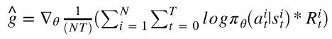
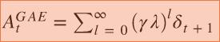
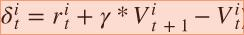

# Homework3-Policy-Gradient report

### Policy Gradient
Basically, most reinforcement learning algorithm aims to maximizing expected accumulated discounted rewards. In policy gradient, the objective function is modeled as a function of policy. We use a function approximator, e.g. a neural network, to parameterize the policy. Policy gradient is the derivative of accumulated discounted rewards with respect to policy's parameters, 

 
          
As the value in expectation is untracktable, we utilize a expectation-log trick to reformulate policy gradient to 



Finally, there are several variants of policy gradient, and what we are using in this assignment is the most basic one, REINFORCE,


Note that since policy gradient is a sampling-based method, it introduces large variance in gradient estimate. Thus we use a technique called baseline and by subtracting baseline (outputing advantage function) we can alleviate the problem,


The following is the implementation. 
```
# parametrization of policy using fully-connected neural network
x=tf.contrib.layers.fully_connected(inputs=self._observations,num_outputs=hidden_dim,
                                    weights_initializer=tf.random_normal_initializer(),
                                    biases_initializer=tf.random_normal_initializer(),                                                                                              
                                    activation_fn = tf.tanh)
y=tf.contrib.layers.fully_connected(inputs=x,num_outputs=out_dim,
                                    weights_initializer=tf.random_normal_initializer(),
                                    biases_initializer=tf.random_normal_initializer())
probs=tf.nn.softmax(y) # probabilities of all valid actions
```
```
# computing surrogate loss
surr_loss = -tf.reduce_mean(log_prob*self._advantages)
```
```
# use baseline to reduce the variance of the gradient estimate
baseline = LinearFeatureBaseline(env.spec)
b = self.baseline.predict(p) # baseline modeled by a simple linear function
r = util.discount_cumsum(p["rewards"], self.discount_rate) # accumulated discounted reward
a = r-b
```

### Baseline Bootstrapping
Apart from using advantage function computed by subtracting aforementioned linear baseline to reduce variance of policy estimate, we use the one-step bootstrap for the advantage function, which change previous advantage function  to,


Using baseline bootstrapping method, we can reach faster convergence time, in CartPole ~ 80 iterations.
```
def discount_bootstrap(x, discount_rate, b):
    y = [ x[t] + discount_rate*b[t+1] for t in range(len(x)-1)]
    y.append(x[-1])
    return np.array(y)
```

### Generalized Advantage Estimation
Previously, we introduce one-step bootstrapping to computing baseline. Actually, such idea can be further extended to n-step bootstrapping and as we go to extreme, we roll-out entire advantage estimate. This method is called Generalized Advantage Estimation (GAE),



where .

This is the implementation.
```
# computing GAE
a = util.discount(a, self.discount_rate*LAMBDA)
```
