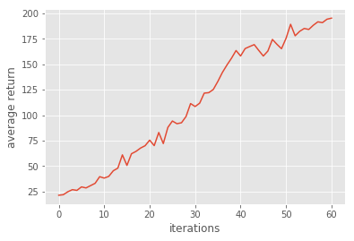

# Homework3-Policy-Gradient report

## Problem 1: Construct a neural network to represent policy

In this homework, we use simple 2-layer neural network to construct policy.


```python
hidden = tf.layers.dense(self._observations, hidden_dim, activation=tf.nn.tanh)
output = tf.layers.dense(hidden, out_dim)
probs = tf.nn.softmax(output)
```

## Problem 2: Compute the surrogate loss


```python
surr_loss = tf.reduce_mean(tf.multiply(log_prob, self._advantages))
surr_loss = tf.multiply(surr_loss, -1)
```

## Problem 3: Baseline Method

Use baseline to reduce the variance of our gradient estimate.

```python
a = r - b
```

## Problem 4: Without Baseline

Why baseline won't introduced bias?


##### Compare with and without baseline

<table>
    <tr>
        <td> With Baseline </td>
        <td>  </td>
        <td>  </td>
    </tr>
    <tr>
        <td> Without Baseline </td>
        <td>  </td>
        <td>  </td>
    </tr>
</table>

> With baseline, we can reduce the variance of policy, so that training can be more stable than without baseline one.

## Problem 5: Actor-Critic algorithm with bootstrapping

<table>
    <tr>
        <td>  </td>
        <td>  </td>
    </tr>
</table>

```python
y = x + discount_rate * np.append(b, 0)[1:]
return y
```

## Problem 6: Generalized Advantage Estimation

<table>
    <tr>
        <td>  </td>
        <td>  </td>
    </tr>
</table>

```python
a = util.discount(a, self.discount_rate * LAMBDA)
```
