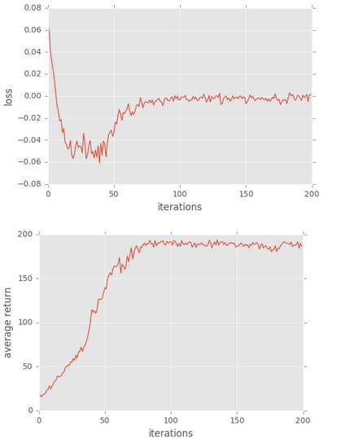

# Homework3-Policy-Gradient report

## Problem 1

Basically just use Tensorflow construct 2 fc layers, and set activation functions to tanh and softmax. I use slim here for simplicity.

## Problem 2

Simply multiply the calculated log probability with the advantage. And use it to compute loss. 
The only thing iportant here is that we want to maximize the surrogate loss, so we need to add a negative sign to the loss tensor, fulfilling the optimizer's minimization objective.

## Problem 3

Simply calculating advantages by subtracting reward with predicted baseline.

</img>

## Problem 4

Comparing against plot in problem 3. The variance in loss plot becomes relatively large.

</img>

About the proof of unbias:
</img>

Basically is because the expectation of gradient of log-probability. The gradient itself can be moved in front of summation. And since the summation result is 1, its gradient is zero, thus it is unbiased.

## Problem 5

Here we implement the actor-critic strategy to replace original one.

But the loss here can't converge very well and tends to have a long-tail training. Possibly current implementation is still too naive.

</img>

## Problem 6

We use GAE in this example, its a kind of compromise between our original strategy and actor-critic. And the result is totally as we expected, its a smooth form between two approaches.

</img>

## Plot everything togather

This plot can make it more clear to compare between prob 3/4 and 3/5/6.

</img>

