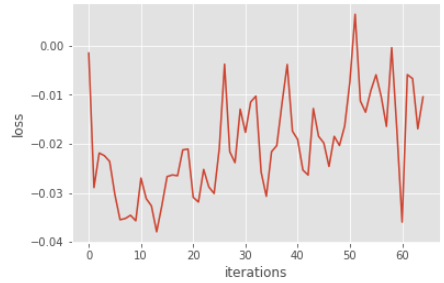
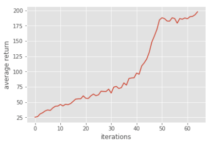
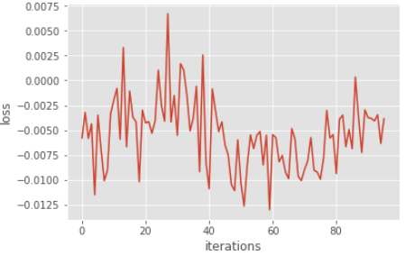
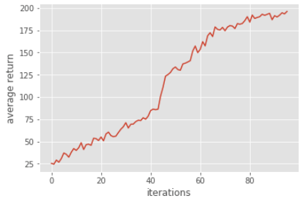
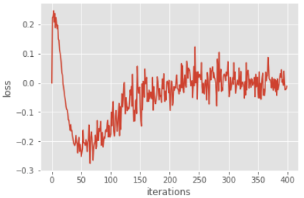
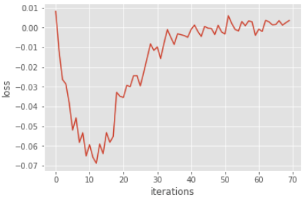
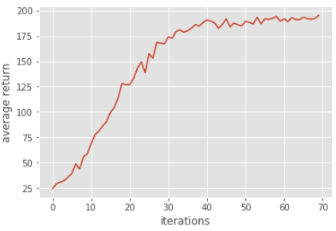

# Homework3-Policy-Gradient report

TA: try to elaborate the algorithms that you implemented and any details worth mentioned.
## Problem 1
建立兩層fc layer代表policy nerwork，其中input為observation、output為此observation對應的機率。

**Implementation in ipynb:**

`hiddenLayer = tf.contrib.layers.fully_connected( inputs = self._observations, num_outputs = hidden_dim, activation_fn = tf.nn.tanh )
probs = tf.contrib.layers.fully_connected( inputs = hiddenLayer, num_outputs = out_dim, activation_fn = tf.nn.softmax )`

## Problem 2
計算policy network的loss，也就是surrogate loss。
1. 每個episode中，我們需要對每個time step的Ri(存在self._advantages中)*log(pi(a|s))(存在lod_prob中)的和(亦可以取平均但結果應該相同)。
2. 計算max log-likelihood，但tensorflow中，僅計算min log-likelihood，因此我們需要改成計算minize negative log-likelihood。

**Implementation in ipynb**

`surr_loss = -tf.reduce_mean(log_prob*self._advantages)`
    
## Problem 3
我們使用採取的action的reward(r)減掉baseline estimate的reward(b)來減低training的variance。這種計算advantage的方法，可以encourage那些reward比baseline高的action，反之不然，因此可以穩定training。

**Implementation in ipynb**

`a = r - b`

### Result of Problem 1 to 3
|Training Loss|Return|
|-------------|---------------|
|||

## Problem 4
The results of training with/without baseline is following

||Training Loss|Return|Training Iteration|
|---|--------|-------|----|
|With Baseline|||About 65|
|Without Baseline|||About 95|

觀察training的結果我們可以發現，沒有baseline時loss較不穩定，且接近收斂時的reward上升速度變慢，這兩點可以證明有baseline的情況下variance較小，training較stable。

加入baseline後，reward較baseline低的action的gradient都為0，反之，reward導數為正。這樣計算advantage的方法，因為只鼓勵reward高於baseline的action，因此可以降低variance並穩定訓練，使收斂速度變快。
    
## Problem 5
使用新的actor-critic演算法來取代原始的advantage function。
1. 原始的advantage function使用現在的time-step t到最後的time-step的immediate reward來做discounted sum。
2. 新的算法是使用one-step boostrapping來計算，這種算法將reward改成此time-step的immediate reward加上discount後的下一個time-step的immediate reward。

新的算法亦可以降低varience，但可能有較高的bias，導致training變得不穩定，很難converge。

**Implementation in ipynb**

`b = np.append(b[1:], 0)
return x + b * discount_rate`

**Training Result**

|Training Loss|Return|
|-------------|---------------|
|||

## Problem 6
用Generative Advantage Estimation(GAE)來修改one-step boostrapping actor-critic algorithm。GAE可以綜合前面兩種計算reward的方式，達到降低variance並穩定training，使收斂時間變短。

**Implementation in ipynb**

`a = util.discount(a, self.discount_rate * LAMBDA)`

**Training Result**

|Training Loss|Return|
|-------------|---------------|
|||